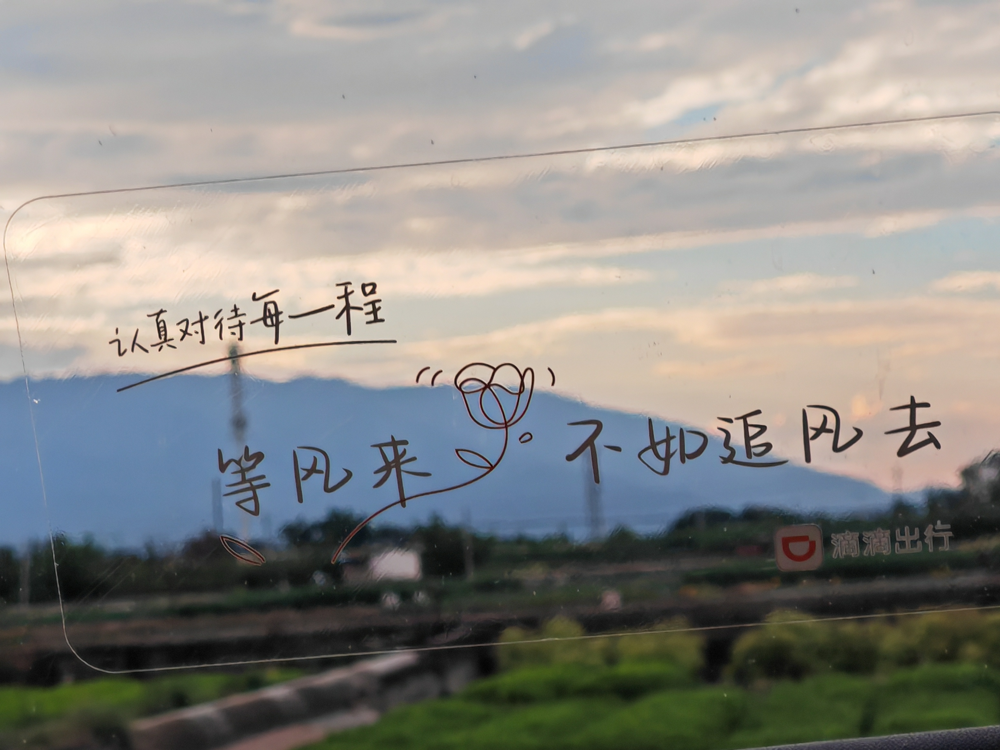
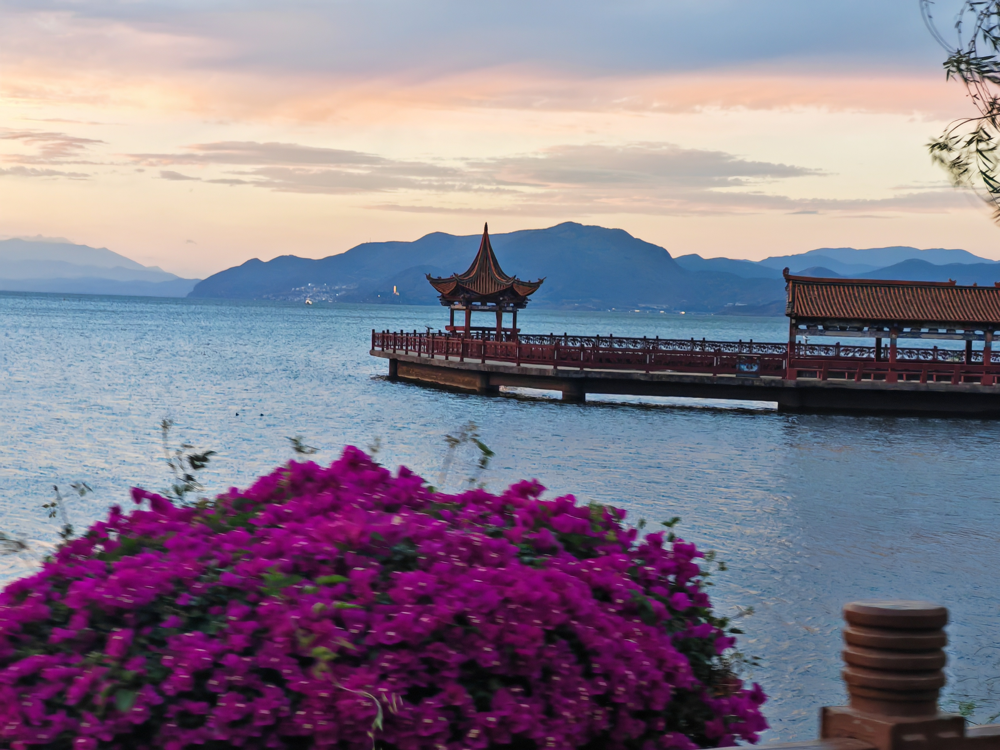

# 云南

提前置物
骆驼冲锋衣 399元
墨镜 79元
上述】】】】】478元

民宿+酒店
19 昆明酒店 134元
20-21 香格里拉 272元
22-23 丽江 256元
24-25 大理 226元
26 昆明 91元
上述】】】】】979元

交通费
车票+机票
深圳飞昆明 500元
昆明-香格里拉 230元
丽江-大理 退票 3.5元
大理-昆明 145元
昆明飞深圳 500元
上述】】】】】1378.5元

自驾费
停车费 7+20+8+5=40元
滴滴 378.67元
租车819元
油费 329.92元
高速 71+34+86=191元
上述 1758.59元
人均】】】】】586.2元

5-19 深圳飞昆明 
滴滴回酒店
高尔夫云南菜 77元
哈罗电单车 2.5元
滇池公园 麦当劳甜筒 4元
海埂大坝 前面的便利店买水 5元
蜜雪冰城 9元
菌彩野生菌火锅 87元
大众点评下单 0.6元（鲜花饼）
哈罗电单车 2.5元 
上述】】】】】187.6元

5-20 昆明-香格里拉
滴滴到昆明站
到站租车，睡个觉
车站白水 3元
午餐 塔洛藏餐吧 65元
晚餐 一千零一夜 70元
古城超市买水 6元  
外卖氧气瓶+甘油 28.8元
上述】】】】】172.8元

5-21 香格里拉
古城早餐，八个耗牛包两个鸡蛋 31元
氧气瓶 20元
开车去松赞林寺，门票 90元
点香 1元
松赞林寺买水 5元
午餐 家常菜 59元
普达措国家公园门票 139元
买水 13元
雨衣 30元
晚餐外卖 
上述】】】】】388元

5-22 香格里拉-丽江
早餐 KFC 14元
开车去那帕海 骑耗牛 20元
小中甸服务区 买水 11元
午餐 家常菜 44元
虎跳峡 46元
老板帮忙抢票 大索道 140元
小索道 40元
美宜佳买水 10元
晚餐 云雪丽餐厅 106元
登山氧气 10元
上述】】】】】441元

5-23 丽江
早起日照金山
进山费 50元
美宜佳 买水+小食品 18元
袁记云饺 35元
买水 10元
下山游客中心KFC 45.9元
瑞幸咖啡 27元
下山回来
阿婆情腊排骨 77元
清吧喝酒 88元
上述】】】】】350.9元

5-24 丽江-大理洱海
凌晨喝完酒美宜佳 3.50元
丽江-大理 开车
卓玛餐厅买书（景区门口） 6元
拉市海湿地公园门票 15元
午餐 世外姚园 38元
晚餐 西餐 96元
小区楼下超市老祥云 2啤酒+1苏打 20元
上述】】】】】178.5元

5-25 大理洱海
开车去大理古城
午餐 云隐小厨 吃到肚子痛 70元
还车前的加油站买水 6元
走路去大理古城
喜茶柠檬茶 11.9元
滴滴电单车去龙龛码头 20元
龙龛码头骑行 6.5元
滴滴回民宿
充电宝 4元
晚上和其他刚好来云南旅游的人吃云南白族菜＋喝酒打牌 95.9元
上述】】】】】214.3元

5-26 大理-昆明
滴滴去大理站
滴滴去民宿
窑鸡王外卖 47.8元
冰红茶 3元
重庆鸡公煲 25.3元
冰红茶 3元
上述】】】】】79.1元

5-27 昆明-深圳
民宿滴滴去机场
鲜花饼回家 55.8元
鲜花饼学校 28.9元
滴滴 机场到学校
上述】】】】】84.7元

总共 5518.6元