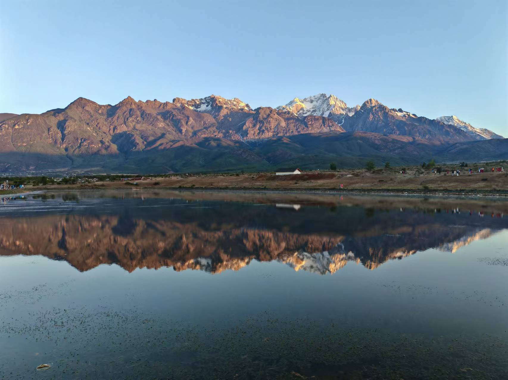
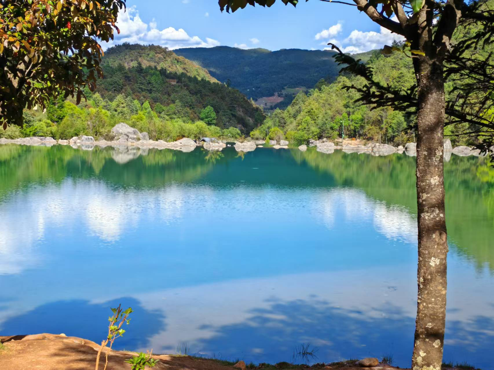
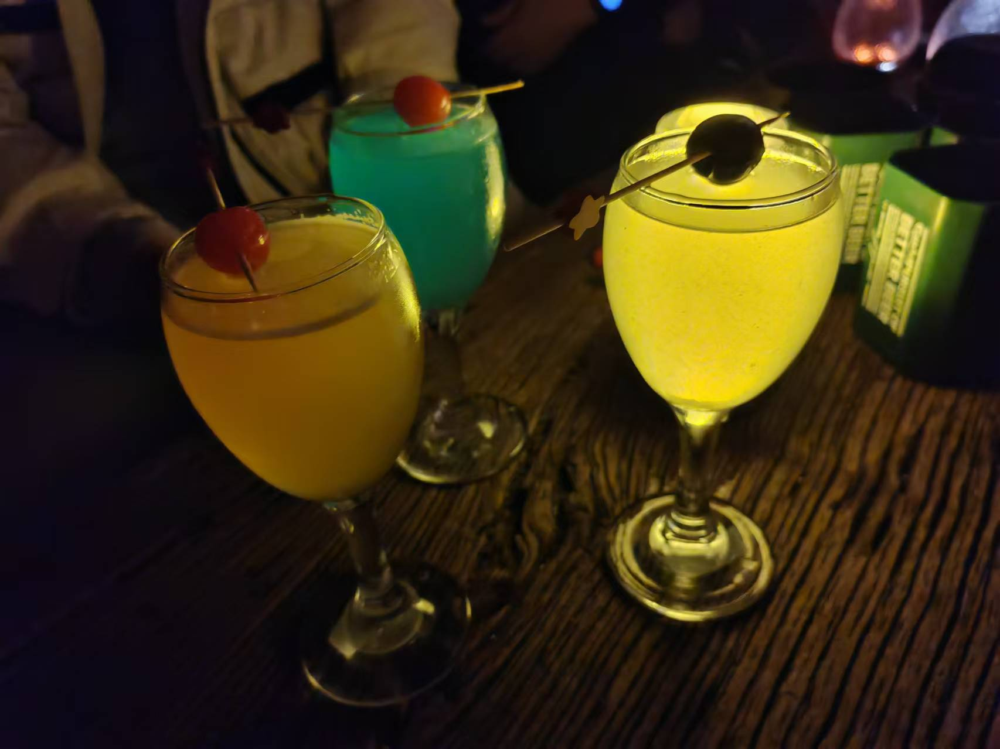
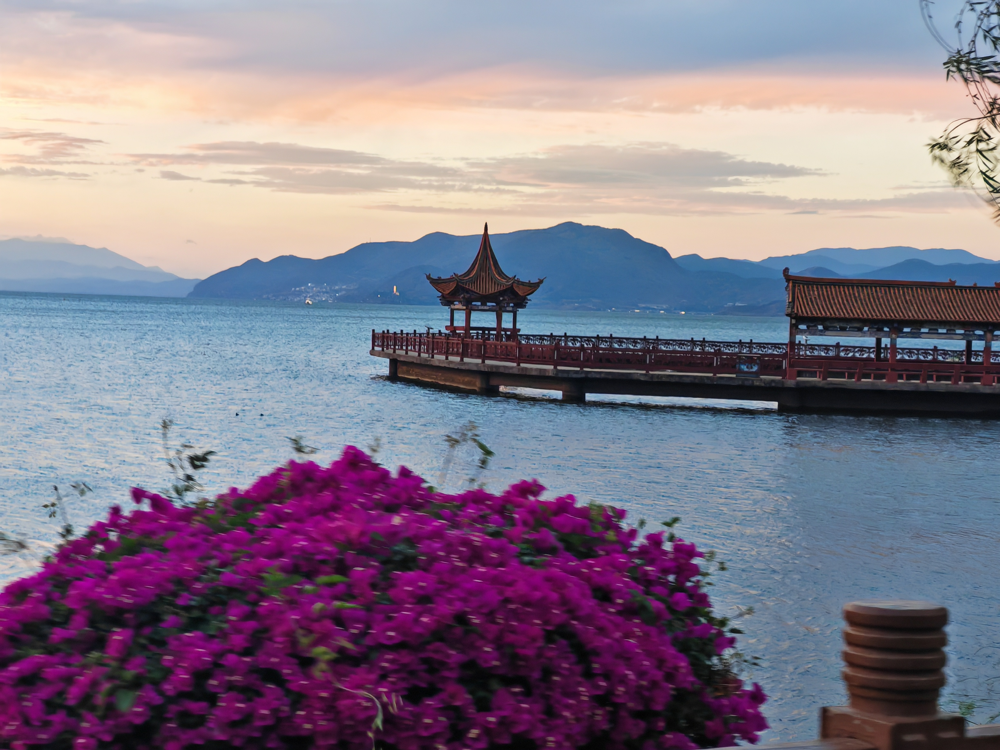

# 云南

在毕业之际，决定来一次组团旅游，几番决定之后，选择云南作为毕业旅行。

七彩云南，怎么停留怎么欣赏都不为过，对于我这个又沿海又低洼的地方，玉龙雪山是我这次最期待的地方。

一周下来，感觉喜欢上了云南，如果有机会，我想以后能带另一半再次重游，也许会有不一样的人生体会吧！

## Day1 2024.5.19 周日

一如计网地深圳飞昆明，对于旅客而言，好像昆明只是一个停留的方法，一个中转的地方。

景点也就是滇池公园、海埂大坝等等，还去了一个官渡古镇，只能说名字一样而已。

本来还想去云南民族博物馆，都预约好了，结果和民宿相隔太远，当时天气也不太好，所以就取消行程了。

中午飞机落地，到长水，接着就是入住云南民族村。

吃了一个云南菜试试水，看着滇池公园，也开始了我们的一周之旅了，像梦一场。

因为预算还可以，就入住了一个豪华点的酒店了，就在公园旁

出门试了几个菜，然后我们就逛一逛了，有点潦草，但还有个云南特色菜没有拍进来。（吐槽：好绿啊

滇池公园的风吹得挺舒服的，让人想搬张凳子，不用多大，就那种折叠凳，在那坐着，和几个好友一起聊着天长南北。

我们几个秉持着麦当劳甜筒打卡机制，就留了一个合照，开盒的同学不要开了，我错了

海埂大坝没啥好看的，一般是季节好的时候大早上去拍鸽子，我们下午去到巨热，蒸桑拿了属于是。所以照片也就没留。

然后这天气说变就变，我们直奔官渡，还以为有惊喜，原来就是传统的“新”景点，老三样，我在这里很想你、羊肉串、水帘洞

然后找个连锁的菌彩野生菌火锅，味道挺好的，也终于吃到当地的原生菌火锅了。

云南的景点让我特别喜欢的就是提供电单车，而且还是平价的那种，2.5元，我们直接从这里骑回去，虽然下起了小雨，但是挺爽的。

## Day2 2024.5.20 周一

由于行程是我安排的，所以我就猛一点啦，直接干到香格里拉，然后从香格里拉玩回来。

还是那句话高铁提前抢，昆明到香格里拉，放心不是坐绿皮，但是速度也没这么快。

从云南的基建可以看出土木老哥的威力，各种高架桥，高铁也能穿过玉龙雪山，这就是人民的力量。

高铁路程大约五个小时，基本耗费一个早上的时间，我的评价是金铲铲启动！

到了独克宗古城，民宿放东西，然后去经典`塔洛藏餐吧` ，一个大众点评上就有的，然后许多明星打卡过的餐馆。

民宿小姐姐告诉我们，第一天来到香格里拉最好不要洗澡，然后睡眠充足一点，不然容易高反。

所以我们相当于吃完午饭就直接回民宿了

睡个觉再次觅食！！

古城附近逛个够

最经典还得是这个！名字啥的我也忘记，也不想再搜了，直接放图：

吃货吃货，经典一千零一夜

看看晚上的模样，很香格里拉

我们是今天开始租车，意味着香格里拉、丽江、大理都是用小车车通行了！

## Day3 2024.5.21 周二

古城早餐，八个耗牛包两个鸡蛋 31元，不评价。

开车去松赞林寺，门票 90元，来都来了，不管什么神，上一根香先说。

刚好那时候的天气挺好，七彩云南嘛，只要有太阳，就能照出多彩的颜色，无需点缀自身就是最好的那个

去转转赛博偷懒功德

松赞林寺有很长的楼梯要爬，建议高反就提前准备氧气瓶，反正云南这三个点氧气瓶常备就OK了，防止被景区坑。

然后驱车来到普达措国家公园门票 139元，天公不作美，或者说高原气候反复无常，像极了我认识的那谁

这片森林诉说着我当时的感受，而且当时下的不仅仅是大雨，还有一点碎碎冰，哥们的相机绷不住了。进水报错，佳能果然不能伴我历经沙场。

海拔如下：

## Day4 2024.5.22 周三

离开古城驱车前往那帕海，浅显的说就是天很蓝，草很绿

那个叫啥，风吹草地现牛羊

然后就离开香格里拉了，哈巴雪山下次再会。

还记得来的时候做的高铁吗，现在就看到了

香格里拉-丽江线图中有个虎跳峡，虎跳峡是世界有名的徒步路线，不过我们没有进行徒步，就是买票进行参观了，还是很壮观的。当水奔流而下，我无法言诉当时的感觉，只能感慨，有些景色只有身临其境才能发出感慨，人之渺小。

到达丽江古城，有点塞车，建议时间规划再好一点

去往民宿的路上

还是花花好看

晚上夜景

晚上还是云雪丽，不过这家我真不好评价。真的不好评价，虽然大众点评榜前面，大伙去吃一次就知道了。

准备好明日登山的票，一定一定要让民宿老板帮你抢，他是提前放票的，不然你就跟旅游社，旅游社帮你安排的就不止是玉龙雪山索道的票了。优先抢冰川公园的索道票！

## Day5 2024.5.23 周四

日照金山是对玉龙的尊重

5点钟天还没亮，就已经有很多人驱车前往玉龙脚下看日照了。可以去东巴谷也可以去玉龙景区里面的甘海子

所有人都在等日出，山也在等

等日出和周围的同龄人聊了许多，啥都聊，这也是旅游的乐趣——侃大山。

虽然全程录下来了，但限于静态博客的限制，所以就放张图片了

还有拍婚纱照的，挺唯美的，有机会可以，你也可以。

《侧脸不会被人认出来的》

看完日出就进山了，交个进山费再来个门票费

三个点就不一一赘述了，直接放图

抢票只抢到中午的，所以中午氧气准备直接爬上去拉，登顶，orz，拍的很多都是正脸合照，就不放了，尬住了，4680都是和脸合照，失算了

蓝月谷：水绿则深，这里不深也绿

路旁还有只小动物，不太怕生，可能也是蓝月谷的景点之一

回到去

吃喝吃喝

还挺好吃的哈

一般，流水线作业。

## Day6 2024.5.24 周五

今天自驾前往大理洱海

途中去了拉市海湿地公园，天气好的话，风景挺漂亮的，尤其是那些花，估计那种大妈旅游团会非常喜欢。

午餐找了家类似农庄的地方吃了，还行吧，便宜实惠，世外姚园

去往民宿的图中因为要绕着洱海走一圈嘛，所以我们去了双廊古镇走一走。

古镇都是一样的，一样的配置，一样的帅哥美女，一样的喧闹，建议如果要住古镇的话，挑一个安静的古镇入住。

在洱海边开车是真的舒服，天气好的时候打开车窗，感受下自然，感受一下风从身边经过的感觉，特别舒服。

所以洱海这边有很多租敞篷车的地方，看个人需求吧。

然后在这个路标这里停下来，静静欣赏风景，合影留念。

民宿入住，刚好能看到洱海一角。

也恰巧当时的人没这么多，阿姨好心帮我们换了一间更大的民宿，3人入住8人间，还是看看远处的洱海吧家人们。

喝了点酒就睡觉了。

## Day7 2024.5.25 周六

早起出发去大理古城

还是一样的配置，我们当时去好像那什么开封王婆也来到云南，但是路程太远就没去凑热闹了。

中午的某个小厨吃到同行两个人（包括我）的肚子都不舒服，如果不是食品问题，那只能归咎于两人肠胃同时不舒服的概率了，遂打差评。

把租的车还回去，自驾就到此为止了。

然后滴滴前往龙龛码头，只能说大理人民有福了，傍晚吃完晚饭可以去骑骑车，看看风景，看看外地旅客的样子。

一朵鲜花给予你，愿你未来安好。

我也加入骑行大队伍当中，在这个海拔上骑行，我还是第一次。虽然也不高

还是那个多彩云南，只需要出太阳，就能很好看。

因为有其他同学碰巧也来到了大理洱海，碰巧也有空，所以我们说聚一聚吃个饭，所以赶忙返程了。

给滴滴打广告了。

傍晚的时候，可以看到厚重的云层从苍山下宛若江河一般倾泻而下

湖中亭应是如此，可以被拦了无法进入。

吃了正宗白族菜，可以可以

## Day8 2024.5.26 周日

高铁大理-昆明，又回到了最初的地方。

开躺，整理照片，金铲铲启动。

晚上看了会F1。

## Day9 2024.5.27 周一

大早上赶飞机，无事回家。

本来是打算Day7就回家的，但是太赶了。

虽然最后留了一天什么事都没干的Day8，但想着在云南昆明发呆一天何曾不是一种享受呢？

未来会有多少次机会这样什么事都不做，忠实着人生信条——发呆呢？

希望未来安好。

有挺多好看的风景照片因为个人自拍的原因无法放出来，大伙可以去小红书、b站等地方看一看，挺美的。

给这段路程留点遗憾，给下段行程给点期待。

哈巴雪山留给下一次准备出发的我，也是准备出发的你吧！

