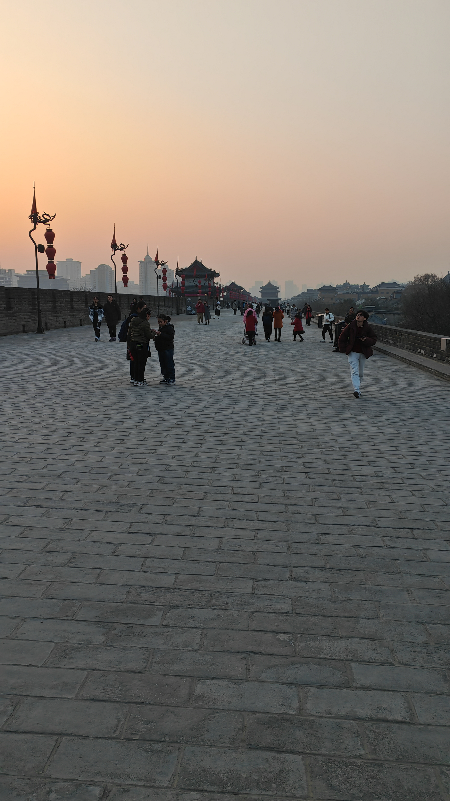

# 西安

考完研的第一时间，就准备去进行一个人的旅游。

在纠结去北京还是去西安的选择上，`qny`跟我说还是去西安看看吧，所以就去了西安。

从深圳宝安国际机场飞到陕西西安，学生淡季提前买的话挺便宜的，如果你有南航的99元的那个学生优惠，可能还能便宜，我当时就是六百多。

提前准备：

一定要看天气预报，一定要看天气预报！！！

北方不是南方，所以去玩的时候，一些外衣，厚裤子都可以不用洗了，只带一些要换的内衬，实话说一周都穿同一件衣服都可以。

对于一个南方人而言，去北方要挑一个稍微冷一点的季节去，可以顺带看到传说中的雪。所以羽绒服啥的、户外鞋啥的最好准备好，有一些景点很大，需要疯狂地走，所以不要穿高跟鞋噢。

景区充电宝租用很贵，建议带个1w5的充电宝，旅游嘛，一天从酒店出来的时候就打算晚上才回到去。

地图自行标注吧。

行程安排

## Day1 2024.1.8 周一

一个人独自打滴滴前往机场，3个小时的飞机飞到了咸阳国际机场，机场离市中心不是一般的远，当时打出租车去回民街那里放东西，打了116元。好像那里滴滴挺少的，又或者跟其他城市一样，太远了，滴滴都不想过去了。

我当时定的是回民街的民宿，但是我的建议是住在大雁塔附近比较好！问了很多当地的司机师傅，没必要住在回民街，虽然回民街离机场是比较近的，但是后面的行程基本都是围绕着大唐不夜城也就是大雁塔附近。

所以定民宿建议还是大雁塔附近，酒店随意。

如果住在回民街的话，有一个福利就是每天出行完，回民宿的时候可以看着夜晚灯光的钟楼、鼓楼，这是一个西安经典的打卡点，每天晚上都可以看到一大堆汉服小姐姐在那里拍照。

钟楼、鼓楼都可以现场买票，只有白天才能上去看一看，两个点学生票都是15元，来都来了还是上去看一下，旅游咱就是来消费的。

回民街附近经典还有西安城墙，之前西安城墙上面美团都是可以骑上去的，现在不行了，被管理起来。有承包商安排骑行的自行车。我去的时候是45元/180分钟单人车，双人的话要更贵一点，有钱的可以尝试，走累了或者情侣也是推荐的。

然后你任意选一个门上嘛，然后选一个门下，它只收你一个门的钱，我从文昌门上27元，然后走走走走到了建国门就下了，因为建国门附近有个石碑林，里面的石刻纪念馆25元，对这方面感兴趣的里面就是很多珍宝！对西安历史不了解的，或者不感兴趣的，可以外面逛逛吧，我看到很多人都是花钱进去然后没几分钟就出来了。

安居巷、三学街，永兴坊。就城墙下，随便逛逛都是一个景点。来旅游讲究的就是一个悠闲，漫无目的，不要特种兵。

晚上找了个那边的连锁品牌，兰湘子尝尝特色，感觉它的定位这么像辣可可的呢hhhhh，深圳人老毛病，找吃的第一时间找商城。

当时回到回民街到处都是吃的，买了个经典炒酸奶，拿了些经典烤串当作宵夜，看着鼓楼的美景，回去洗澡睡大觉。

## Day2 2024.1.9 周二

八点多，陕历博一定要去，提前预约，一定要准时开抢。他们都说不去陕历博，就相当没去过西安了。

行程安排任意。

逛展就是看个人速度了。

然后可以找个口地铁去大雁塔，感觉西安地铁还是挺便宜的。

到大慈恩寺就进去，大雁塔在里面。大慈恩寺门票也就20元学生票。

然后大雁塔上去也是要门票的，学生票10元。上下楼梯不要直上直下，侧着身子上下嘛，楼梯很窄，上面风景挺好，只不过隔着玻璃，也拍不到啥的。

大慈恩寺遗址公园很大，慢慢逛。

有个小tips：门口附近有个那种礼品店，然后可以免费嫖两张那种盖章的东西，代价就是要进去逛一圈，你不要买就可以了。然后拍照还是挺合氛围的。

然后附近景点也是一样的套路，什么感恩镇啥的。

芙蓉园可去可不去，学生票60元半价。芙蓉园和一些经典冲突的，而且也适合晚上去，我去的时候迎新春应该，很多都在装修，灯展装修。

如果去的话，紫云楼必上，还是挺壮观的。

看个人时间安排，

芙蓉园出去走一会就是不夜城了。这是西安一张名片，大唐不夜城，也推荐是晚上再来逛，这就是我为什么推荐大伙去大雁塔附近住，每天晚上都可以逛，很big。

他就是以大雁塔、和不夜城一条直线的景点。里面有个西安美术馆，免费入场，可以到时候看一些有没有感兴趣的展，可以考虑进去。

## Day3 2024.1.10 周三

来了西安，华山就是必选的选项。

华山也记得提前买票，在我的印象里好像可以北上北下或者西上西下？就是给那些不登山的人准备的。

但是我们应该选择北上西下，北峰单程进山车，195元当时。

出发准备，就是最早的一趟高铁，西安北站-华山北站，54.5元当时。注意，华山在渭南，需要提前抢高铁票，然后提前去高铁站，因为早高峰！

准备：

- 保暖杯
- 一个汉堡或者葡萄糖，没想到汉堡有奇效hh

出高铁站，直接打出租车，11元就到华山景点了，门口可以拍照，然后发个`小小华山，轻松拿捏`的pyq。

进山车20分钟一班，人满也发

爬山嘛，经典的华山论剑。

你也可以选择晚上去爬，不过就是危险一点，但是可以看日出，还是有挺多人去看日出的，xhs

西下的索道巨爽，二十多分钟，一览华山风景。

下山车40元，没有学生票，只有小孩子和残疾人有半价票。

那个30块钱滑道感觉还挺值，不过没去玩

在爬华山的时候遇到了在西安附近某大学的三名研究生学长，交流甚欢，帮我拍了张照，，便离开了。这也是旅行的乐趣吧，认识更多的人。

返程高铁，然后地铁，剩下时间任意安排。

## Day4 2024.1.11 周四

今天就是重点，课本上的知识重现脑海，浮现眼前。

还记得秦兵马俑吗？现场去看，会觉得这就是奇迹之一！

秦兵马俑秦始皇帝陵博物馆（学生证编号就是学号，已买，60元），也是提前预约，建议就是淡季出发。

7元地铁，很久很久，睡了一觉，然后滴滴去秦兵马俑那里，门口有个耳机可以租，就是到一个地点会讲解不同的东西给你，感兴趣可以租，30元一天，押金一百。

xhs说最左边的vr影院可以打印纸质票留作纪念，我当时取得时候他已经没有打印的存票了，机子有，票无了，so sad。

当时不知道哪个外国领导来了，封馆，反正就是他去到哪，哪里就要封馆。

一号坑来来回回逛个两三遍都可以。

最后导览仪不要带出园外了，在门口记得还回去，拿回你的押金。

然后你的票是附带另一个景点的！

只不过要去1号停车场，做摆渡车去丽山园，丽山园东西比较便宜，门口小贩，毕竟没这么多人来的

入园买15元观光车，建议买，因为不买就是枯燥的走路环节，还有华清宫要走呢，还是买观光车吧

课本上的铜车马就在那

华清宫也是重点！60元预约，不包括长恨歌。

可以去景区外面的小区楼下吃一份肉拌臊子面，我感觉很符合我的口味，真的好吃。被西安当地人所肯定的店铺味道肯定也不会差到那里去。

华清宫就算是网上订票进门还是需要去售票处换成纸质票

轶事：

- 华清宫里面碰到一堆人在那里拍御净轩，我搁里面刚出来呢，尬到我了，卫生间表示很赞。

有米的可以在里面泡泡温泉，毕竟杨贵妃也在里面泡过hhh。

然后里面有个骊山，可以直接坐索道，上面风景也是挺好的，如果你要全程爬下来，建议还是量力而行，因为他不是山，全TM是楼梯，感觉爬起来比华山还累，直接膝盖暴击！

华清宫六点多清场。准备长恨歌的演出。

华清宫里面一个长恨歌！！！！！

哥们姐们，不管你有没有钱，都省点，买这个！长恨歌长恨歌！

## Day5 2024.1.12 周五

由于上述的行程对我而言是OK的，因为我是一人出行，180大伙，全程无压，甚至有点悠闲。

赶不了的同学可以随意安排，感觉重要的点就是这几个了。

你还可以去看一下西安的早市，感受一下当地中小学生上下学的氛围。

睡大觉

北大街10元，拖行李，懒得降价了

13:10-16:00的飞机-咸阳国际机场 600元

家人们再看看远处的钟鼓楼吧

去西安犯了一个大病，很多照片都是有自拍的，风景没拍几张，怕被盒武器，所以就挑了几张看得过去的独享背景了。下次去云南的时候就不会了hhh

