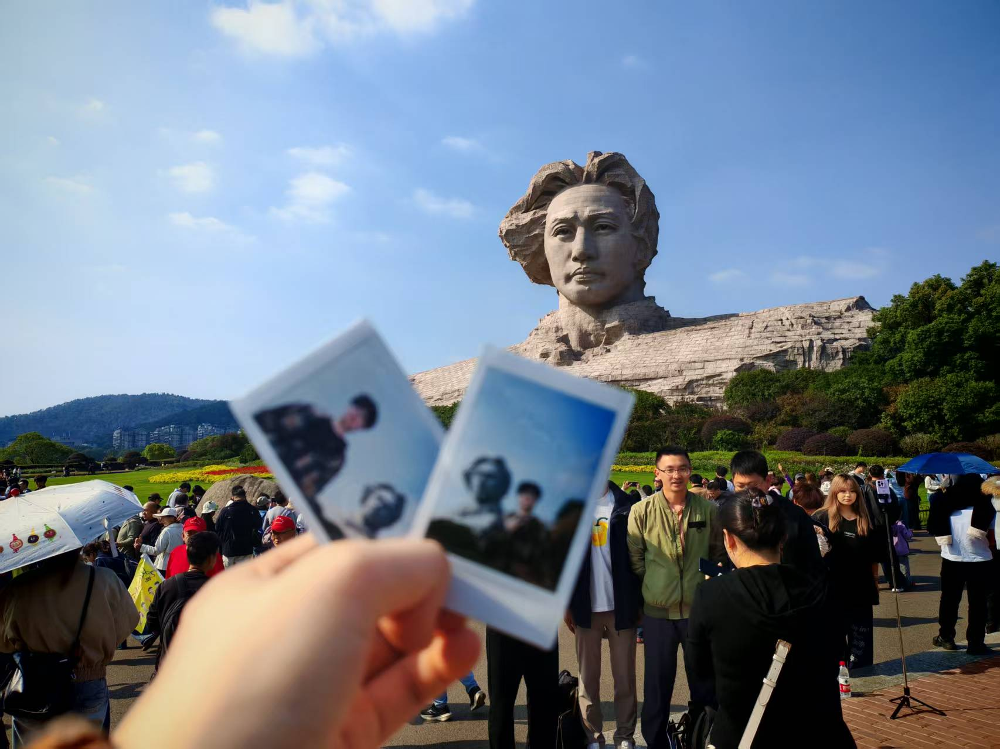
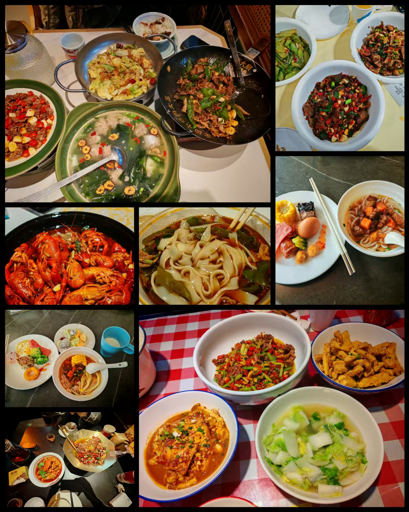
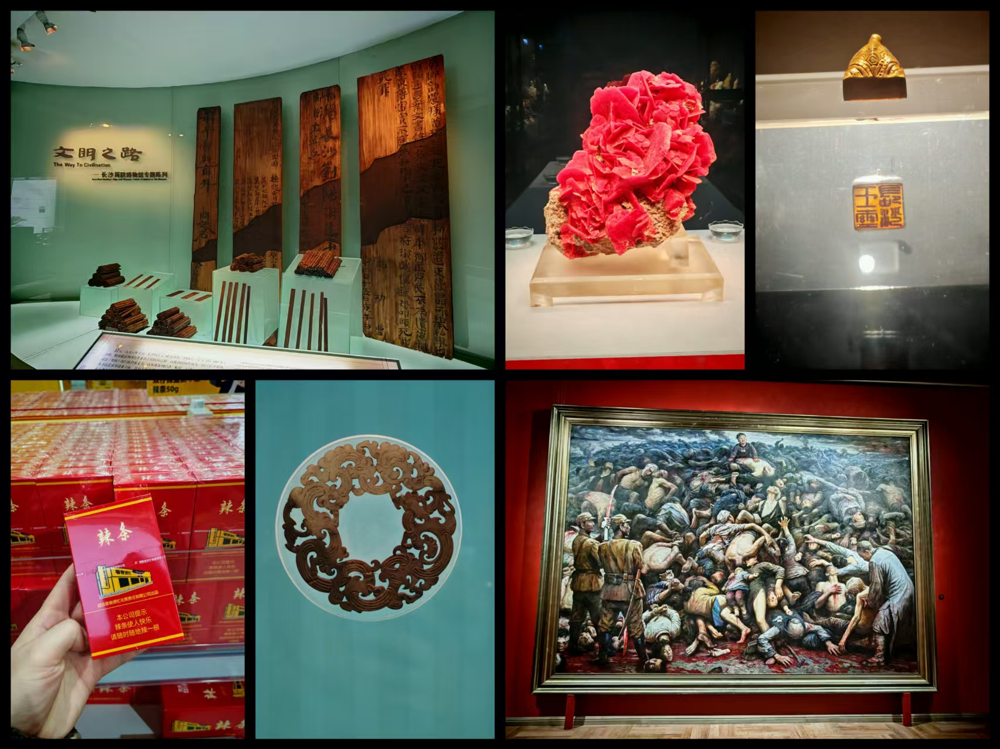
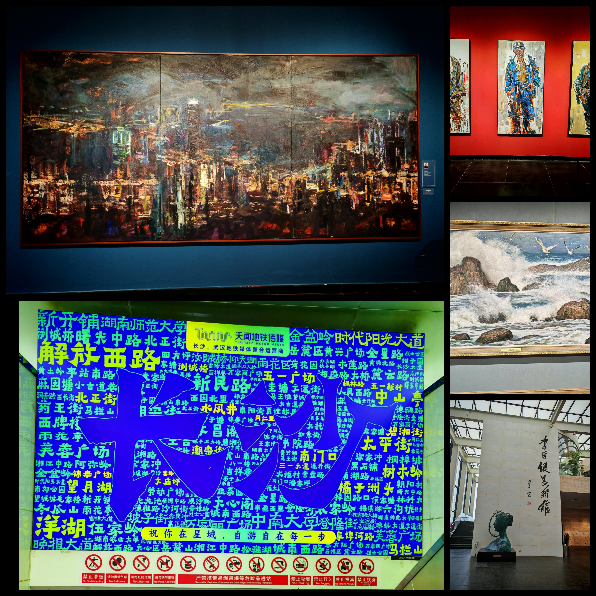
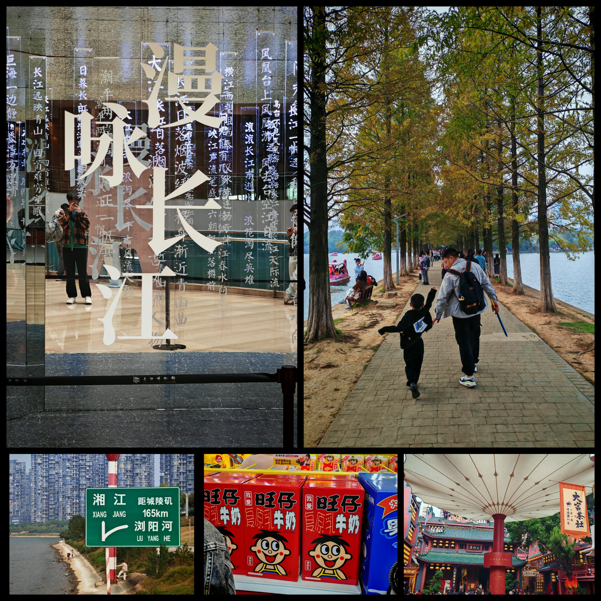
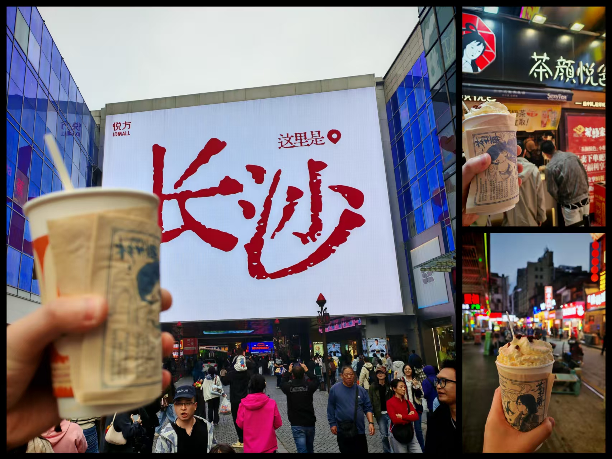
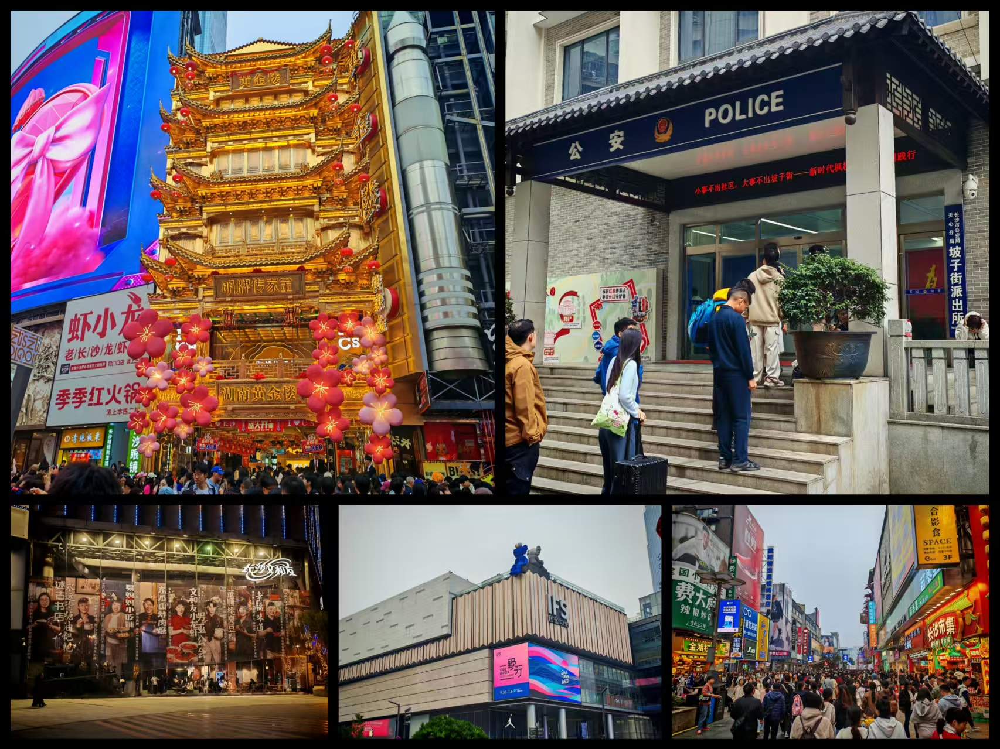

# 长沙

最近一直很心急，就想着出去转转，故来到了长沙。

长沙，一个茶颜悦色、酱板鸭、臭豆腐比厕所还多的地方。

正巧是长沙马拉松的时候，故行程紧急做了些微调，其实真要看，2天足矣。

出发长沙还是高铁实惠一些，就是返程途中全是回来深圳打工的人，也算体验了一次超绝800米冲刺换乘。

第一天当然橘子洲合影：

长沙的辣还是让我一个广东人感觉到不舒服，吃辣能力有限，所以那几天的酒店洗手间都被我承包了。也尽量点那些名字中带有小炒黄牛肉之类的名称的店，辣度之类还能接受。吃的几餐中，感觉到性价比高又没这么辣的是那家叫什么东风路小炒黄牛肉，好吃不贵。

各种看展，对于我们这种不听讲解、历史忘得差不多、艺术细胞又没有这么好的人而言，就是去拍照镇馆之宝就可以了。别人逛3个小时，我们走马观花1小时不到，真正的man，真正的特种兵。

雅雅雅！但是李自健这馆还是离市区有点远了，我们还是先做地铁参观了地质博物馆之后，然后出来打滴去的李自健，我们也是一俗人，就没去谢子龙影像馆了，~~主要是要钱~~

岳麓山，爱晚亭，少了点秋色，没了点情。

我的评价是不如骊山，就因为有一个爱晚亭杵在这里了。人多，网红景点。

古开佛寺也是，仁者见仁，智者见智了。

一直逛展，拍照。

第一次从长沙博物馆出来到那边广场上做的时候，我还以为那个是真路牌，就跟别人说下面有条马路。

走前去看结果我是傻逼，这不是给车看的，这是给船看的。

来了长沙，当然也不能忘了经典的茶颜悦色，喝了三天的幽兰拿铁，买了点手信回去。（总有好事在路上！

味道还行，没有传的这么夸张。只能说本土企业，走不出来在其他地方，或者说只在其他地方搞快闪店也是有原因的。亦或者是企业战略导向。

忽略哥们发育不良的指甲。

网红长沙，同质化太严重了，那几条网红街，太平老街、潮宗街、五一广场、ifs、坡子街、文和友之类的基本上都是这个套路。

解放西经典抱头鼠窜。

当初是直接画了一个半径较大的圆去寻找目的地的，长沙没去过也正好去了。

怎么评价呢，合影和茶颜悦色这两个任务完成就已经来过长沙了。我只能这么说。

长沙很好，下次和别人继续去。:smiley:

