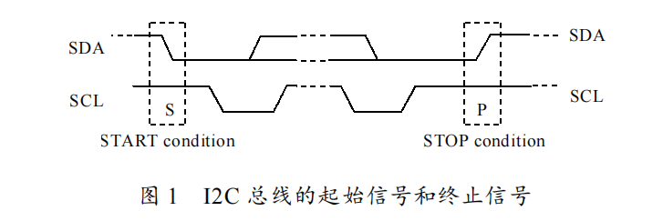
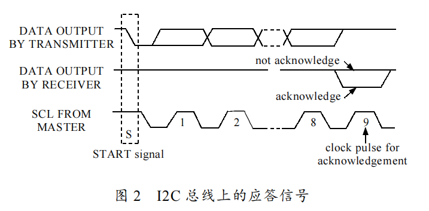
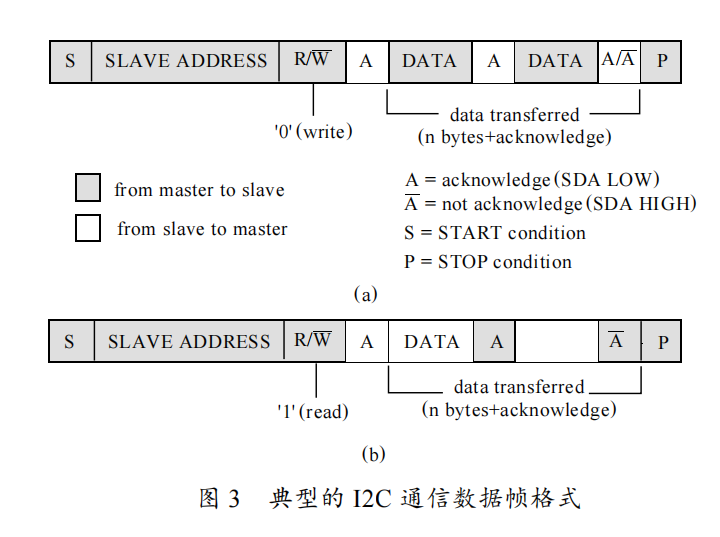

# iic

当面试官问到 I2C 协议时，你可以考虑以下几个方面进行回答：


## ①I2C 协议的工作原理是什么？

I2C（Inter-Integrated Circuit）是一种串行通信协议，用于连接微控制器和外部设备，如传感器、存储器、转换器等。它使用两根线（SDA和SCL）进行通信，其中SDA线传输数据，SCL线传输时钟信号。I2C协议采用主从结构，主设备通过发送地址来选择通信对象，并控制总线上的时序。从设备只能在主设备的控制下发送和接收数据。

iic全称：（$Inter-Integrated-Circuit$）是内部整合电路的称呼，是一种串行通讯总线，多用主从架构，1980年飞利浦公司研发。

iic有两条线，一条是串行数据（SDA）和串行时钟（SCL），每个器件都有一个唯一的地址识别；

半双工；串行总线；主从结构；


I2C协议的通信过程如下：

主设备发送起始信号（Start）：主设备将SDA线从高电平拉低，接着将SCL线从高电平拉低，以发出起始信号。在起始信号之前，主设备必须获得总线的控制权。

主设备发送从设备地址：主设备在SCL线为低电平时，发送8位地址，最高位指示读写方向（0表示写，1表示读），剩余7位表示从设备的地址。

从设备发送应答信号（ACK）：被选择的从设备收到地址后，将SDA线从高电平拉低，以发出应答信号。如果SDA线保持高电平，则表示从设备不存在或无法响应。

主设备发送数据或命令：主设备在SCL线为低电平时，将8位数据或命令发送给从设备。

从设备发送应答信号：从设备接收到数据或命令后，将SDA线从高电平拉低，以发出应答信号。如果SDA线保持高电平，则表示从设备无法响应。

主设备发送停止信号（Stop）：主设备将SCL线保持为高电平，接着将SDA线从低电平拉到高电平，以发出停止信号。在停止信号之后，主设备释放总线的控制权。

以上就是I2C协议的基本工作原理。

## ②I2C 协议的主从设备是什么？如何区分主从设备？

在I2C协议中，主设备是发起通信的设备，从设备是被动响应通信请求的设备。I2C总线上只有一个主设备，但可以有多个从设备。

在I2C协议中，主从设备的区分是通过设备地址实现的。主设备发送一个设备地址，从设备通过识别这个地址来确认是否需要响应通信请求。因此，每个从设备都有一个唯一的设备地址，而主设备通过发送对应的设备地址来和从设备进行通信。在传输数据时，主设备控制总线并向从设备发送数据，从设备则在主设备的控制下响应数据。


## ③I2C 协议中的起始信号和停止信号是什么？有什么作用？

I2C协议中的起始信号和停止信号是两种特殊的数据信号，用于指示数据传输的开始和结束。

起始信号是由主设备发出的，在数据传输之前发送。它告诉从设备数据传输即将开始，从设备需要做好准备。起始信号由SCL线拉低后，SDA线从高电平跳变到低电平构成。

停止信号是由主设备发出的，在数据传输之后发送。它告诉从设备数据传输已经结束。停止信号由SCL线保持高电平时，SDA线从低电平跳变到高电平构成。

起始信号和停止信号的作用是标识数据传输的开始和结束，使得主设备和从设备都能够准确地识别传输数据的开始和结束，从而避免数据传输的错误。


==STM32开发时要设置为开漏输出！！！！==

[](https://imgse.com/i/p9loaz6)


**起始信号：SCL为高，SDA由高向低跳变；** SDA在高电平至少4.7us，然后拉低至少4us；

```c
void iic_start(){
	SDA_OUT();//SDA设置为输出模式；
	SCL_HIGH;
	SDA_HIGH;
	delay();
	SDA_LOW;
	delay();
}
```

**结束信号：SCL为高，SDA由低向高跳变；**SCL先拉高至少4us，SDA再拉高4.7us；

```c
void IIC_Stop(void)
{
	SDA_OUT();//SDA设置为输出模式；
	SCL_LOW;
	delay();
	SDA_LOW;
	delay();
	SCL_HIGH;
	delay();
	SDA_HIGH;
	delay();
}
```

**应答信号：接收完数据后，发送低电平脉冲；应答信号都是SCL从低到高至少4us，然后SDA发送相应的数据；**

[](https://imgse.com/i/p9loyod)


## ④I2C 协议的数据传输方式是什么？如何控制数据传输速率？

I2C协议的数据传输方式是基于帧的，一个完整的数据传输帧包括7个位，其中第一个位是起始位（Start Bit），表示数据传输的开始，最后一个位是停止位（Stop Bit），表示数据传输的结束，中间的5个位则是数据位（Data Bits），用于实际的数据传输。

在I2C协议中，主设备通过控制SCL时钟线的上升沿和下降沿来控制数据传输的速率。在传输数据之前，主设备发送一个时钟脉冲序列，使得从设备的SDA线保持稳定的电平状态，然后主设备发送起始信号（Start Bit），接着发送从设备的地址和读写位，最后从设备返回应答信号（ACK Bit）。在数据传输期间，主设备控制SCL时钟线的脉冲频率，从设备在每个时钟脉冲之后将数据位发送到SDA线上，主设备接收数据并返回应答信号（ACK Bit），以确保数据传输的正确性。在传输完所有数据之后，主设备发送停止信号（Stop Bit）来结束本次数据传输。

控制数据传输速率的方法是通过控制SCL时钟线的频率来实现。在I2C协议中，可以定义不同的标准时钟频率，包括标准模式下的100Kbps和快速模式下的400Kbps。此外，还可以使用高速模式和超高速模式来实现更快的数据传输速率。主设备和从设备需要在同一个时钟频率下进行数据传输。

[](https://imgse.com/i/p9loOS0)


I2C 协议中的 ACK/NACK 是什么？有什么作用？


## ⑤I2C 协议中的地址格式是什么？有哪些类型？

I2C协议中的地址格式分为7位和10位两种类型，其中7位地址是标准模式，可以用于大多数应用，10位地址则是扩展模式，可以使用更多的设备地址。每个I2C设备都有一个唯一的7位或10位地址，用于识别该设备并与之通信。

在7位地址模式下，地址由7个比特位组成，其中前6个位用于设备地址，最后一个位用于选择读或写模式。在10位地址模式下，地址由10个比特位组成，其中前4个位被设置为固定值，接下来是一个可变的设备地址，最后两个位用于选择读或写模式。需要注意的是，10位地址模式的设备数量较少，而且设备的地址分配也比较复杂，因此在实际应用中较少使用。


7位寻址，第八位为读写位，其中0为写write，1为读read；最低位（LSB） 是第8 位；

8位地址，厂商将最后一位包含而已；

10位地址：需要在初始化的时候配置为10bit地址模式（由第一个字节设置，固定前缀**1111 0xxx xxxx xxx_** 其中十位x就是十位地址，_为读写位；


## ⑥I2C 协议中的重复起始信号是什么？有什么作用？

I2C协议中的重复起始信号（Repeated Start）是在一次完整的数据传输过程中，在主设备和从设备之间进行连续传输时，主设备在不断地发送数据时不需要先发送停止信号再发送起始信号，而是直接发送重复起始信号。

重复起始信号的作用是可以在一个数据传输过程中，连续地访问同一个从设备。在一些需要读取多个寄存器的应用中，使用重复起始信号可以避免每次读取都需要重新定位从设备的地址，从而提高数据传输的效率。


## ⑦I2C 协议中的时钟同步是什么？如何实现？

I2C协议中的时钟同步是指主设备通过时钟线向从设备传输时钟信号，以确保数据传输的同步性和准确性。I2C协议中的时钟信号由主设备产生和控制，从设备只能跟随主设备的时钟信号进行数据传输。

I2C协议的时钟同步通过两根信号线来实现，即SCL和SDA线。在数据传输之前，主设备首先向SCL线上发送一个时钟脉冲，然后向SDA线发送起始信号。之后，在数据传输的过程中，主设备每发送一位数据，就会向SCL线发送一个时钟脉冲，以通知从设备数据的传输状态。在数据传输完成后，主设备会向SDA线发送停止信号，以结束整个数据传输过程。

通过时钟同步，主设备和从设备可以实现数据的同步传输，并且可以保证数据传输的准确性和可靠性。


## ⑧iic的特点？

一般有上拉电阻，一般为4.7k~10k之间，默认拉高；

多主机会产生总线裁决问题。当多个主机同时想要占用总线时，企图启动总线传输数据，就叫做总线竞争；


## ⑨软件iic和硬件iic有什么区别？

==IIC实现分为硬件IIC和软件IIC两种；==

软件IIC是使用程序控制SCL，SDA两线输出高低电平，可以适用任何管脚，来模拟IIC协议的时序，较为灵活；

硬件IIC，只需要调用写好的硬件IIC的控制函数，而不用去模拟电平，而且是固定管脚，不能灵活应用，胜在速度快，效率高，可以使用DMA


## ⑩iic能有多少个从机？

7位地址算，LSB为读写位，就是2^7=128，但是地址0x00是保留地址，故有127个地址，理论上可以挂127个从机设备；
但是规定了总线电容不超过400pF，所以实际就是不超过8个左右从机设备；


## ⑩①线与的作用？

参与主线多主机的仲裁机制；

仲裁原则：当多个主器件同时想占用总线时，如果某个主器件发送高电平，而另一个主器件发送低电平，则发送电平与此时SDA总线电平不符的那个器件将自动关闭其输出级。

如果主设备A拉高SDA时, 已经有其他主设备将SDA拉低了. 由于 **1 & 0 = 0** 那么主设备A在检查SDA电平时, 会发现不是高电平, 而是低电平. **说明其他主设备抢占总线的时间比它早**, 主设备A只能放弃占用总线. 如果是高电平, 则可以占用.


## ⑩②为什么要用开漏输出？

IIC协议支持多个主设备与多个从设备在一条总线上, 如果不用开漏输出, 而用推挽输出, 会出现主设备之间短路的情况. 至于为什么需要上拉电阻, 那是因为IIC通信需要输出高电平的能力.

开漏输出还能实现 **线与** (自行百度), 减少一个与门, 简化电路.


## ⑩③推挽输出和开漏输出的区别？

推挽输出：输出逻辑0，则N-MOS激活；输出逻辑1，则P-MOS激活；

开漏输出：

在不接上拉电阻时，输出逻辑0，则N-MOS激活；输出逻辑1，P-MOS不会激活，不会输出高电平；

在接上拉电阻时，输出逻辑0，则N-MOS激活；输出逻辑1，P-MOS激活，可以输出高电平；

总结：

开漏输出如果不接上拉电阻，没有输出高电平的能力；


## ⑩④如何确定iic的通信方向

在IIC协议中，传输方向是由主设备（Master）通过控制总线上的时钟信号来确定的。具体来说，在IIC总线上，主设备负责发出时钟信号和控制信号，从设备（Slave）则根据主设备的控制信号来确定数据的传输方向。

在IIC总线上，数据传输是双向的，也就是说主设备可以向从设备发送数据，也可以从从设备接收数据。

为了实现数据的双向传输，IIC总线上使用了一个叫做“时分复用”（Time Division Multiplexing，TDM）的技术。具体来说，在每一个传输周期中，主设备通过控制信号来确定传输方向，然后从设备在对应的时间段内向总线上发送数据或接收数据。

由于总线上只有一个主设备和多个从设备，因此在同一时间内只会有一个设备在进行数据传输，从而避免了数据冲突和错误的发生。

需要注意的是，在实际使用IIC总线进行数据传输时，还需要注意数据传输的时序和协议。具体来说，主设备需要在发送数据前先向从设备发送一个地址码，以确定数据传输的目标设备；而从设备在接收到主设备发送的地址码后，需要向主设备发送应答信号，以确认数据传输的目标设备已经被正确识别。此外，还需要考虑数据的传输速率、数据的格式等因素。

在IIC总线中，主设备通过控制总线上的时钟信号来确定数据的传输方向。具体来说，主设备向总线上发送时钟信号，每个时钟周期称为一个“时钟周期”（Clock Cycle）。在每个时钟周期内，主设备根据需要向总线上发送或接收数据。

IIC总线上的时钟信号是由主设备控制的，主设备通过控制SCL（时钟线）信号的电平变化来控制时钟信号。当SCL信号处于高电平时，IIC总线处于空闲状态，此时主设备可以向总线上发送起始信号（Start Condition）；当SCL信号从高电平变为低电平时，表示一个时钟周期的开始，此时主设备可以向总线上发送数据或读取从设备的数据；当SCL信号从低电平变为高电平时，表示一个时钟周期的结束，此时主设备需要等待从设备的应答信号。

根据时钟信号的变化，主设备可以控制数据的传输方向。在发送数据时，主设备将数据按照一定的格式（例如，帧格式、字节格式等）写入数据寄存器，并向总线上发送起始信号和从设备的地址码，然后将数据依次发送到总线上。在接收数据时，主设备需要向总线上发送读取命令，并等待从设备的应答信号，然后从总线上读取数据。