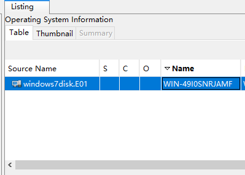
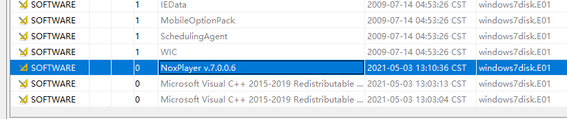
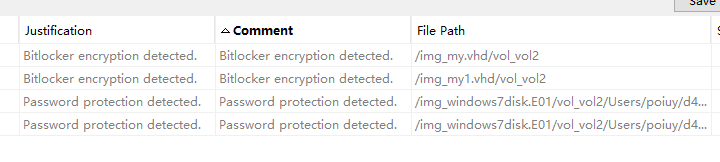
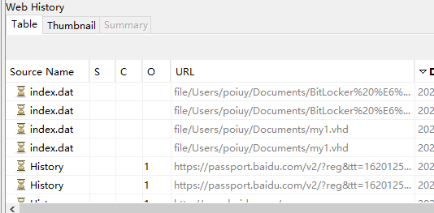
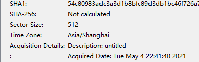
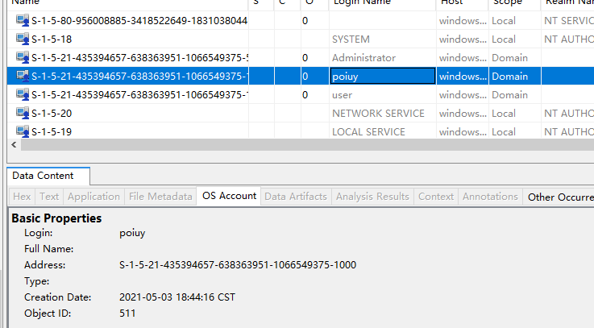
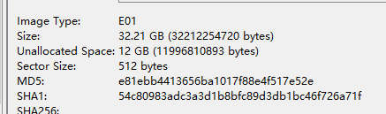
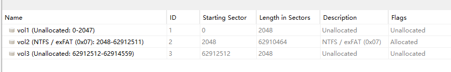
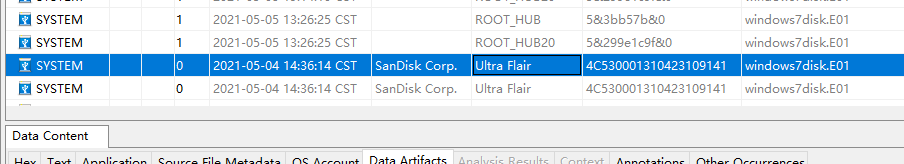

# DIDCTF练习靶场


## 2022暑假取证学习

autopsy打开


### 第一题

操作系统主机名

```
WIN-49I0SNRJAMF
```

直接看data artifacts一栏的系统信息




### 第二题

请给出源磁盘的SHA256哈希值。

```
4547A61A11064DF47B272A4803788597F9A5E9AC0F11A93ABE58C8B8588956CB
```


还是那里直接看，没有计算就计算


### 第三题

请找出操作系统中安装的Android模拟器名称和安装日期。
格式：模拟器名时间
例子：雷电模拟器2022年06月23日

```
夜神模拟器2021年05月03日
```


直接去下面的`installed programs`里面找

`NoxPlayer`夜神模拟器找到了




### 第四题

请找出使用Bitlocker加密的虚拟磁盘文件。
格式：1.txt/2.txt

```
my.vhd/my1.vhd
```


VDI、VHD、VMDK 和 VHDX 都是虚拟磁盘文件的后缀

我们直接拉到下面的`Analysis Detected`

然后找到`Encryption Detected`

就看到有两个`Bitlocker`

然后`file path`的虚拟磁盘文件就是答案




### 第五题

请找出操作系统安装日期。
格式:2022-01-04 12:47:43

```
2021-05-03 18:44:28
```


### 第六题

请找出操作系统最后登录的用户。

```
poiuy
```


### 第七题

请找出操作系统中安装的浏览器最后浏览过的网站域名 [格式： www.baidu.com]

```
passport.baidu.com
```


下面的`Web History`然后按照时间排序，找到是网站的域名就是答案




### 第八题选择题

请找出操作系统中安装的浏览器名称的对应的安装日期。

本题仅一次答题机会

360浏览器2021-05-03 20:16:43

Edge浏览器2021-05-03 20:26:44

谷歌浏览器2021-05-03 20:16:44

搜狗极速浏览器2021-06-03 20:16:44


```
SOFTWARE	org.sleuthkit.datamodel.Score@103ba122	NO_COMMENT	0	Google Chrome v.90.0.4430.93	2021-05-03 12:16:44 CST	windows7disk.E01	
```


### 第九题

请找出操作系统版本号。

```

```


### 第十题

请找出操作系统设置的时区名称。
本题仅一次答题机会

UTC+8

UTC+4

UTC+2

UTC+6

```
A
```


系统信息查看：




### 第十一题

请找出操作系统中安装的浏览器“自动填充”中保存的网站密码信息（网站、用户名、密码）
格式：网站+用户名+密码
例子：https://blog.didctf.com/+admin+admin111

```

```


### 第十二题

请找出用户“poiuy”的SID。

```
S-1-5-21-435394657-638363951-1066549375-1000
```


直接下面`OS Accounts` 查看





### 第十三题

请给出源磁盘的大小（字节）。

```

```


### 第十四题

请给出源磁盘的大小（字节）。


直接看源磁盘的Summary

```
32212254720
```

然后Container里面有Size



### 第十五题

请找出各分区文件系统类型。

```
ntfs
```


直接看




### 第十六题

请找出曾经连接到该系统的U盘的品牌、序列号、最后插拔日期。
格式：SAMSUNG+FAWC524213104FAWV146+2022-07-14

```
SanDisk+4C530001310423109141+2021-05-04 14:36:21
```


不知道为什么我的autopsy时间总是对不上的？




### 第十七题

请找出回收站中的文件的名称
格式：2333.exe+1.txt+3.E01
注意顺序

```
nox_setup_v7.0.0.6_full.exe+新建文本文档1.txt+测试.rtf
```

