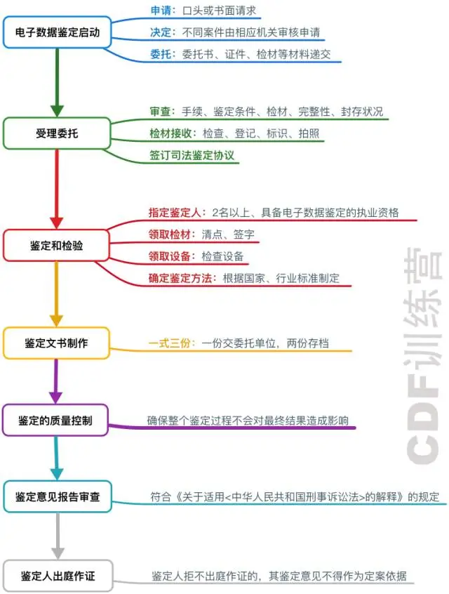

# 电子取证

[历时两年取证学习总结，收藏这一篇就够了！ - 知乎](https://zhuanlan.zhihu.com/p/66827862)

## 概念

主体概念脱胎于犯罪过程中的取证阶段，对于电子数据那就是电子证据。

**物质交换原理是电子数据取证的理论基础，而取证就是寻找各种犯罪交换后留下的痕迹作为证据的活动**。

电子取证包括如下几个方面：

- 证据收集，在证据收集的时候注重电子数据的脆弱性
- 数据获取，数据获取的时候要注意转储过程中的数据完整性
- 数据分析，数据分析就是揭露罪证，找到和嫌疑人的关系
- 撰写报告，报告撰写重要的环节，关乎庭审和法内事实的判定

**电子数据取证的终极目标是：**为法庭审判提供合法的证据。

这个需要时刻记住，电子取证服务的对象到底是什么？

## 司法鉴定

什么是司法鉴定？

在诉讼活动中鉴定人运用科学技术或者专业知识对诉讼涉及的专门性问题进行鉴别和判断并提供鉴定意见的活动。

司法鉴定的三方：委托方、被委托方、公证方

委托方一般就是检察机关、执法部门等，被委托方就是鉴定机构和鉴定人，也可能是某些官方机构内的人。

这里偷图了，感谢：

司法鉴定要保证保管和监督的记录完整和可追溯，主要是让鉴定结果的科学和公开。程序正义。

## 执法流程

- 制定现场方案
- 物理隔离人机
- 现场保护搜查
- 证据提取固定
- 物证封存收缴

证据为大，一切行为都要在确保自身安全和保护证据的前提下进行。

## 取证相关术语

- **Digital Forensics**

数码+法医学（司法科学）

所以电子取证的英文本身就有犯罪调查分析、合乎法律标准的证据的含义

**在合乎法律标准的情况下，通过「数码」层面的分析，找到能够证明犯罪现场真实情况的证据的一项司法活动。**

- **电子取证对象**：

**devices，data，information；image**

既然是从「数据层面」分析，那么分析对象自然是**数据（data）**，我们需要从数据中寻找有用的**信息（information）**；而数据的载体是各种电子**设备（devices）**，但为了保护源证据不被修改，我们通常会对**镜像（image）**进行操作，而非源设备本身。

- **电子取证要求**：

**legitimacy，originality，standard，security**

在电子取证中，要尤其注意证据的**原始性（originality）**，数据的**安全性（security）**；整个过程必须是严格遵守司法鉴定**标准（standard）**，**合法性（legitimacy）**是电子取证的前提。

- **电子取证目标**：

**evidence，crime**

电子取证中的终极目标是找到能够证明**犯罪（crime）**真实情况的**证据（evidence）**，不是从头到尾地分析镜像上的每一个数据，更不是恢复所有删除内容等。

- **电子数据鉴定过程**：

**gather，acquire，analyze，report，note，investigate**

前面还有一步是**收集证据（gather evidence）**，但之前也说过这一步通常是由现场搜查人员完成的，而非鉴定人。在整个鉴定过程中，鉴定人都必须对每一步做好详细的**记录（note）**，这样才能够保证整个**调查（investigation）**过程可以复现。

## 电子取证工具

- 磁盘镜像
- 软件写保护
- 硬件写保护
- 字符串检索
- 哈希数据分析
- 删除文件恢复
- 文件碎片重组
- 数据安全擦除
- 移动设备分析
- 文件隐写分析
- 远程取证
- 内存获取与分析
- Windows注册表分析
- P2P分析
- 云服务分析
- 社交媒体分析
- 即时通讯软件
- 密码恢复
- 浏览网页取证
- 可视化镜像取证
- 邮件分析
- GPS取证
- WiFi取证
- 键盘数据取证

Windows工具箱：[NirLauncher - 下载最新软件包](https://launcher.nirsoft.net/downloads/index.html)

然后将汉化包复制在x64目录下和nirsoft目录下即可，注意杀软的允许。

参考资料：

[三分钟带你快速看懂电子数据取证！ | 打击网络犯罪必备知识](https://mp.weixin.qq.com/s?__biz=MzIyNzU0NjIyMg==&mid=2247484173&idx=1&sn=85190c5218eb2ec5e0a5d3e2d8838400&chksm=e85ec60cdf294f1acc4361344aca0552e95baa0983d2f9221f3f723ec8be77f5baa442c65f62&scene=21#wechat_redirect)

[价值上万的电子数据取证课程笔记大公开 | CDF训练营（一）](https://mp.weixin.qq.com/s?__biz=MzIyNzU0NjIyMg==&mid=2247484239&idx=1&sn=8fa21054fc89d61dd70e12fdda7e4214&chksm=e85ec64edf294f58af1ff5d22e954d2dadc1e890f70ff617b097ceb6c7a0c1aa90eb50029787&scene=21#wechat_redirect)

[如果我抓到了WannaCry病毒的作者，我要怎么做才能定他的罪？](https://mp.weixin.qq.com/s?__biz=MzIyNzU0NjIyMg==&mid=2247484181&idx=1&sn=c7d06bb03d0c800765f76d2b3f641959&chksm=e85ec614df294f0204c7fb12e6de9e23acf98baed28fd432bda9ad2b14a22168f91f44991519&scene=21#wechat_redirect)

[知道这几个英语单词，理解电子取证够用了！](https://mp.weixin.qq.com/s?__biz=MzIyNzU0NjIyMg==&mid=2247484550&idx=1&sn=37147f509ede80534c91f7a1f5d8a33c&chksm=e85ec187df29489199ab09da5154f5816adf0e3b007d2a62791369409b12a38b893c2943927c&scene=21#wechat_redirect)

[果断收藏！电子取证最全清单](https://mp.weixin.qq.com/s?__biz=MzIyNzU0NjIyMg==&mid=2247485449&idx=1&sn=0f115c9ea54538cd85815fae9230facc&chksm=e85ecd08df29441e23ba641fe94cbd356979b7f045d3b6f8623b06b86aeca6bbe6ca1597c202&scene=21#wechat_redirect)

[史上最全取证工具大集锦 | CDF训练营（二）](https://mp.weixin.qq.com/s?__biz=MzIyNzU0NjIyMg==&mid=2247484245&idx=1&sn=3f0f51f7119cfc73bdb49c194923ad73&chksm=e85ec654df294f42de74ea0b1c80d3865de22d68d256316673f13c6fed9e86269eac378eecbc&scene=21#wechat_redirect)

