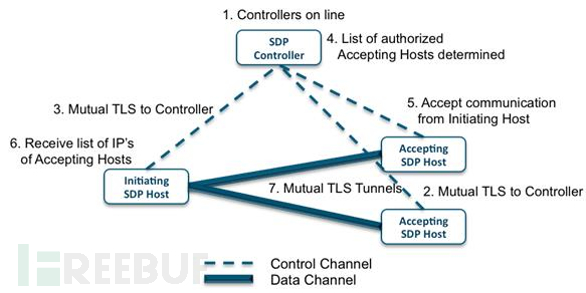
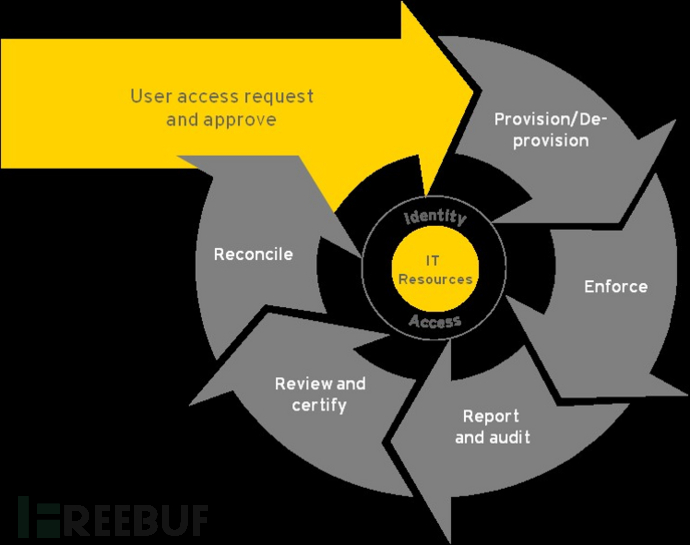
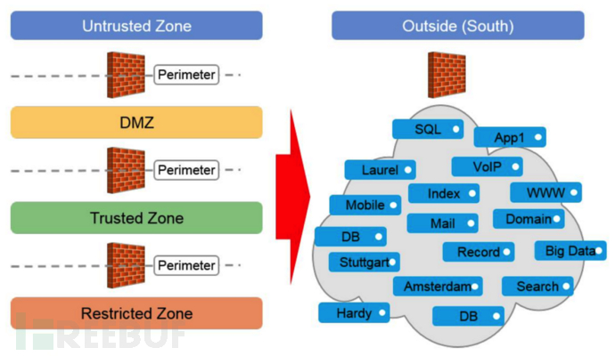
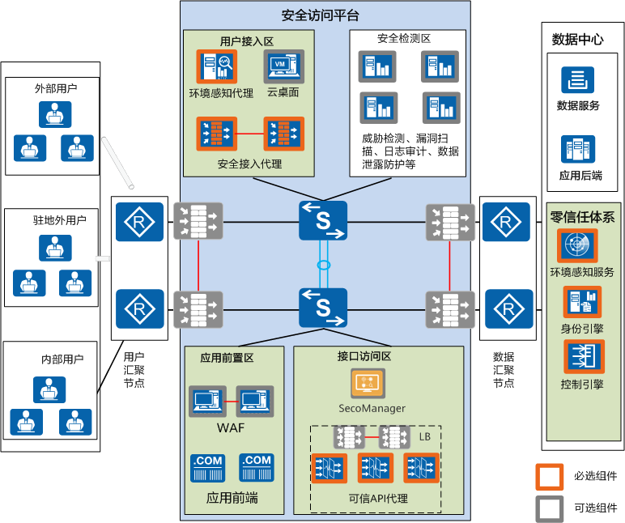

# 零信任

参考资料：

[威努特零信任](https://mp.weixin.qq.com/s/0jXQcKymQtTTWAH53-aitQ)

[零信任架构：2023 年完整指南 - 知乎](https://zhuanlan.zhihu.com/p/651517445)

[一文看懂零信任（起源、发展、价值、实现.） - FreeBuf网络安全行业门户](https://www.freebuf.com/articles/network/263459.html)

[什么是零信任？为什么零信任很重要？ - 华为](https://info.support.huawei.com/info-finder/encyclopedia/zh/零信任.html)

一句话概括：

零信任就是“持续验证+动态授权”的模式

## 基本假设

- 内部威胁不可避免
- 从空间上，资源访问的过程中涉及的所有对象（用户、终端设备、应用、网络、资源等）默认都不信任，其安全不再有网络位置决定
- 从时间上，每个对象的安全性是动态变化的（并非全时段不变的）

## 基本原则

- 所有数据源和计算服务都被视为资源
- 无论网络位置如何，所有通信都必须是安全的
- 对企业资源的访问授权是基于每一个连接的
- 对资源的访问权限由动他i策略决定，也可能包括其他行为属性
- 应该监控和测量其所有自有或者关联的资产的完整性和安全态势
- 所有资源的身份认证和授权都是动态的，并且在资源访问被允许之前严格强制实施
- 企业应该尽可能收集关于资产、网络基础设施和通信的当前状态信息，并将其应用于改善网络安全态势
- 对访问主体的权限分配遵循最小权限原则

- 永不信任
- 假设有漏洞
- 最低权限原则 (PoLP)

## 零信任架构（ZTA）

### SDP，软件定义边界

基于策略创建安全边界，用于将服务与不安全的网络隔离开。

软件定义边界的设计目的是提供按需、动态的安全隔离网络，在授权之前首先对用户和设备进行身份验证，以便于安全连接连到被隔离的服务，未经授权的用户和设备无法连接到受保护的资源。

### IAM，增强的身份治理

IAM全称为Identity and Access Management↳

基于早期的 “基于角色的访问控制 (Role-Based Access Control, RBAC) ”

定义和管理每个网络用户的身份角色及其所需资源的访问权限

根据网络用户身份角色生命周期，对其所需资源访问权限进行动态管理

基于增强身份治理使用参与者身份作为策略创建的关键组件。

如果不是请求访问企业资源的主体，则无需创建访问策略。

对于此种方案，企业资源访问策略基于身份和分配的属性。

资源访问的主要诉求是基于给定主体身份的访问授权，其他因素，如使用的设备、资产状态和环境因素，可以改变其最终信任评分计算。

### MSG，微隔离

通过启用细粒度访问控制将网络划分（隔离）为小的逻辑分段的做法，从而根据逻辑而非物理属性对用户、应用程序、工作负载和设备进行分段。

微隔离提供了优于传统外围安全的优势，因为较小的段呈现出减少的攻击面。

在零信任架构中，安全设置可以应用于不同类型的流量，创建策略将工作负载之间的网络和应用程序流限制为明确允许的应用。

## VPN

虚拟专用网络（VPN）往往难以适配现代科技环境的复杂性。

虽然零信任和VPN并不相互排斥，但许多组织在采用零信任模式后发现VPN并无必要。

VPN提供基于边界的安全，可提供全网访问；

相比之下，ZTNA只允许在验证和认证后访问特定资源。

与VPN相比，ZTNA通过减少攻击面和实施更细粒度的控制，加强了内部和外部网络的安全性。

此外，ZTNA还具有更高的灵活性和可扩展性，提高了资源利用率，减轻了IT压力。

## 应用产品

- 零信任·SDP安全网关
- 零信任·IAM统一身份认证平台
- 零信任·SWG安全WEB网关
- 移动安全管理平台
- 数字化安全工作空间
- 移动业务智能安全平台
- 移动安全态势感知分析平台
- 移动业务审计平台
- 移动安全邮件
- APP/SDK隐私威胁检测平台

## 华为零信任典型组网

