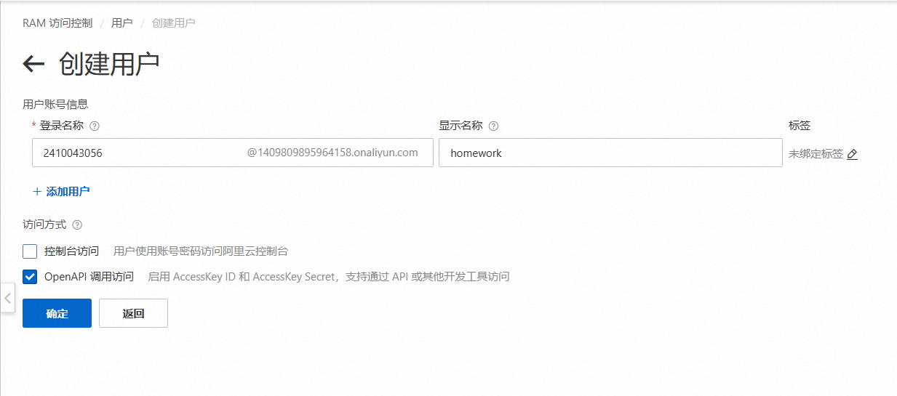
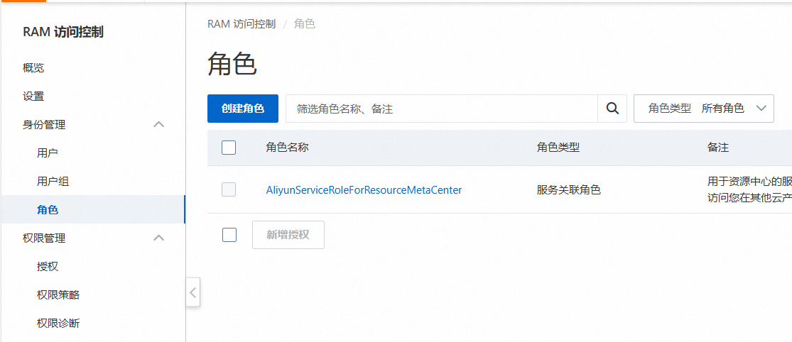

# 信息安全工程作业——访问控制


## 0. 作业描述：

使用阿里云访问控制RAM管理阿里云对象存储OSS，[实验链接](https://help.aliyun.com/zh/ram/?spm=a2c4g.11186623.0.0.10c81d73JmfZ8i),完成如下任务：

- 创建RAM用户
- 创建RAM角色
- 创建权限策略并添加到角色中
- 生成临时访问凭证
- 使用临时访问凭证上传文件
- 使用临时访问凭证下载文件

参考链接：[使用STS临时访问凭证访问OSS_对象存储(OSS)-阿里云帮助中心 (aliyun.com)](https://help.aliyun.com/zh/oss/developer-reference/use-temporary-access-credentials-provided-by-sts-to-access-oss?spm=5176.8465980.security-token.dhelp.34b71450QjQJpV#p-osc-r0m-u63)


## 1. 实现步骤：

### 1.0 创建RAM用户

登录到阿里云控制台，点击管理控制台


在顶部菜单中，选择“RAM访问控制”。在左侧导航栏中，点击”身份管理“-“用户”。


单击“创建用户”按钮，输入用户名称，设置登录方式（选择“OpenAPI”调用访问），点击“确定”完成用户创建。



安全验证方式选择手机号验证，输入短信验证码即可。


操作那一列点击复制，就可以得到访问密钥的信息了。

```
用户登录名称 2410043056@1409809895964158.onaliyun.com
AccessKey ID LTAI5tR1yoLm5zw453nBviLJ
AccessKey Secret HtDCe6trXuwYzs2ImKmxDHpc3yKDqt
```


### 1.1 为RAM用户授予请求AssumeRole的权限

创建RAM用户后，您需要授予RAM用户通过扮演角色来调用STS服务的权限。


点击刚刚创建RAM用户右侧的添加权限，在新增授权页面选择`AliyunSTSAssumeRoleAccess` 系统策略，点击确认新增授权


### 1.2 创建RAM角色

定义RAM角色被扮演时，可以获得OSS服务的哪些访问权限

在“RAM访问控制”页面，点击“角色”，点击“创建角色”按钮。




可信实体类型选择“阿里云服务”，点击下一步


设置角色名称和备注，选择信任的云账号为当前云账号，点击完成按钮。


点击“确定”完成角色创建。


### 1.3 为RAM角色授予上传文件的权限

为RAM角色附加一个或多个权限策略，明确RAM角色在被扮演时所能拥有的OSS资源访问权限

左侧导航栏，选择"权限管理"-"权限策略",在权限策略页面，单击权限策略。


在创建权限策略页面，单击脚本编辑，输入下面的json

```json
{
    "Version": "1",
    "Statement": [
     {
           "Effect": "Allow",
           "Action": [
             "oss:PutObject"
           ],
           "Resource": [
             "acs:oss:*:*:examplebucket/*"             
           ]
     }
    ]
}
```


点击继续编辑基本信息，填入名称和备注后，单击确认即可。


在回到身份管理-角色页面，找到刚刚创建的角色，点击新增授权，选择自定义策略，将刚刚创建的权限策略添加，单击确认即可。


### 1.4 开通对象存储OSS试用服务

由于是做实验，也刚好阿里云有免费试用20w次的额度，所以选择使用即可，超出服务限度要收一定的费用。


然后点击OSS控制台，点击创建Bucket


直接快捷创建，填写Bucket名称，地域为华南1(深圳)，Endpoint为`oss-cn-shenzhen.aliyuncs.com`,存储冗余为`同城冗余存储`

我们先上传手动上传一个文件到OSS上，`2410043056-download.txt`内容为`flag{11111111111111}`


然后选择Bucket授权策略，选择刚刚创建的子账号进行授权，操作为`完全控制`，点击确认即可


至此所有基本配置都已经完成了。


### 1.5 获取临时凭证

​	为角色授予上传文件的权限后，RAM用户需要通过扮演角色来获取临时访问凭证。临时访问凭证包括安全令牌（SecurityToken）、临时访问密钥（AccessKeyId和AccessKeySecret）以及过期时间（Expiration）。


获取临时凭证：

```python
import oss2
from itertools import islice

# 填写RAM用户的访问密钥（AccessKey ID和AccessKey Secret）。
accessKeyId = 'LTAI5tR1yoLm5zw453nBviLJ'
accessKeySecret = 'HtDCe6trXuwYzs2ImKmxDHpc3yKDqt'

# endpoint填写Bucket所在地域对应的Endpoint。以华南1（深圳）为例，Endpoint填写为https://oss-cn-shenzhen.aliyuncs.com。
endpoint = 'http://oss-cn-shenzhen.aliyuncs.com'

# 填写Bucket名称。
bucketName = '2410043056'

# 使用代码嵌入的RAM用户的访问密钥配置访问凭证。
auth = oss2.Auth(accessKeyId, accessKeySecret)
print(auth)
```


可以看到打印出：

```
<oss2.auth.Auth object at 0x000001B08CFA5A10>
```

jupyter运行结果：


### 1.6 上传文件

然后我们在本地创建一个文件为 `2410043056-upload.txt` , 内容为`flag{2222222222222222}`


运行代码：

```python
import oss2
from itertools import islice

# 填写RAM用户的访问密钥（AccessKey ID和AccessKey Secret）。
accessKeyId = 'LTAI5tR1yoLm5zw453nBviLJ'
accessKeySecret = 'HtDCe6trXuwYzs2ImKmxDHpc3yKDqt'

# endpoint填写Bucket所在地域对应的Endpoint。以华东1（杭州）为例，Endpoint填写为https://oss-cn-hangzhou.aliyuncs.com。
endpoint = 'http://oss-cn-shenzhen.aliyuncs.com'

# 填写Bucket名称。
bucketName = '2410043056'


# 使用代码嵌入的RAM用户的访问密钥配置访问凭证。
auth = oss2.Auth(accessKeyId, accessKeySecret)
print(auth)


bucket = oss2.Bucket(auth, endpoint, bucketName)      

# 上传文件到OSS。
# objectName由包含文件后缀，不包含Bucket名称组成的Object完整路径，例如abc/efg/123.jpg。
objectName = '2410043056-upload.txt'

localFile = 'C:\\Users\\jiangxiao\\Desktop\\Learning for Python\\2410043056-upload.txt'
bucket.put_object_from_file(objectName, localFile)

# 生成下载链接
fileLink = 'http://'+bucketName+'.oss-cn-shanghai.aliyuncs.com/'+objectName
print(fileLink)
```


运行结果：


当我们打开云平台进行查看时，也可以看到文件确实是上传成功的。


### 1.7 下载文件

下载文件代码如下：

```python
import oss2
from itertools import islice

# 填写RAM用户的访问密钥（AccessKey ID和AccessKey Secret）。
accessKeyId = 'LTAI5tR1yoLm5zw453nBviLJ'
accessKeySecret = 'HtDCe6trXuwYzs2ImKmxDHpc3yKDqt'

# endpoint填写Bucket所在地域对应的Endpoint。以华东1（杭州）为例，Endpoint填写为https://oss-cn-hangzhou.aliyuncs.com。
endpoint = 'http://oss-cn-shenzhen.aliyuncs.com'

# 填写Bucket名称。
bucketName = '2410043056'


# 使用代码嵌入的RAM用户的访问密钥配置访问凭证。
auth = oss2.Auth(accessKeyId, accessKeySecret)
print(auth)


bucket = oss2.Bucket(auth, endpoint, bucketName)      


#下载OSS文件到桌面。
bucket.get_object_to_file('2410043056-download.txt', 'C:\\Users\\jiangxiao\\Desktop\\final.txt')

```


运行结果：


至此，本次实验已经全部完成。


==完成实验之后，取消授权，并将OSS-Bucket删除、RAM用户删除。==


## 2. 知识点

- 安全认证与授权——访问控制
- API调用规范


