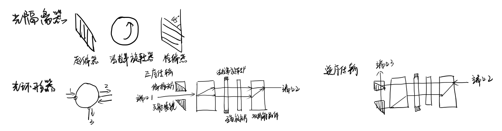

# 第二次作业

## 第一题

1.$Si APD$ 在 $830 nm$没有倍增即 $M = 1$ 时的量子效率为 $70 \%$，反向偏压工作倍增系数 $M=100$， 当入射功率为 $10 nW$ 时，光电流是多少？

解：

没有倍增时的灵敏度为
$$
R=\eta \frac{q\lambda }{hc} =0.70\times \frac{(1.6\times 10^{-19})(830\times 10^{-9})}{(6.626\times 10^{-34})(3\times 10^{8})} =0.47A/W
$$
没有倍增时的初始光电流为
$$
I_{ph0}=RP_{in}=0.47(10\times 10^{-9})=4.7nA
$$

倍增后的光电流为
$$
I_{ph}=MI_{ph0}=100\times 4.7=470nA
$$

## 第二题

2.设$ PIN$ 光电二极管的量子效率为 $80\%$，计算其在 $1.3 μm$ 和 $1.5 μm$ 波长时的响应度，并说明在哪个波长处光电二极管更加灵敏。

解：

$1.3 μm$ 时光电二极管的响应度为
$$
R=\frac{q\lambda (\mu m)}{1.24}=\frac{0.8\times 1.3}{1.24}=0.84A/W
$$

$1.55 μm$ 时光电二极管的响应度为
$$
R=\frac{q\lambda (\mu m)}{1.24}=\frac{0.8\times 1.55}{1.24}=1A/W
$$

响应度正比于波长，$1.55 μm$ 处光电二极管比 $1.3μm$ 处灵敏

## 第三题

3.光缆损耗为 $2 dB/km$，系统的平均连接损耗为 $1.5 dB/km$，光源与光检测器处的连接损耗为每个 $1 dB$，系统余量（裕度）为 $6 dB$，光发送机率为$-13 dBm$，光接收机灵敏度为 $-42 dBm$。设系统为损耗限制系统，求最大无中继传输距离。

解：由已知得：$α_f=2dB/Km$，$α_c=1dB$，$α_连=1.5dB/Km$，$M_s=6dB$，$P_T= -13dBm$，$P_r= -42dBm$。
$$
P_{T} \ge R_{r}+C_{L}+M_{S}=P_{r}+\alpha _{连}L+2\alpha _{c}+M_{S}
$$

$$
-13\ge-42+2*L+1.5*L+1*2+6
$$

$$
L_{max}=6km
$$

## 第四题

4.工作在 $1550 nm$ 的$ WDM$ 系统，信道间隔为 $100 GHz$，请问其波长间隔是多少？如果信道间隔分别为 $200 GHz$，$500 GHz$，$25 GHz$，重复计算其波长间隔。对于这些不同的波长间隔，C 波段能够容纳多少信道？

解：
$$
\Delta \lambda =\lambda ^{2}\frac{\Delta f}{c}
$$

C 波段波长范围：$1530nm-1565nm$，波长带宽为 $35 nm$

| $\Delta f(GHz)$ | $\Delta \lambda (nm)$ | 允许容纳的信道数量 |
| :-------------: | :-------------------: | :----------------: |
|       25        |          0.2          |        175         |
|       50        |          0.4          |         87         |
|       200       |          1.6          |         21         |
|       500       |           4           |         8          |

## 第五题

5、绘图说明光隔离器（Optical isolator）和光环行器（Optical circulator）的结构和工作原理, 试说明两者的共同点与区别。

参考答案：

光隔离器和光环行器都是光学器件，它们在光通信系统中扮演着重要的角色，但它们在功能和结构上存在一些共同点和显著的区别。

共同点：

1. 非互易性：光隔离器和光环行器都具有非互易性，这意味着它们只允许光沿一个方向传输，而阻止或减少反向传输的光。

2. 控制光的传播：两者都是用于控制光的传播方向和路径的光学器件，它们通常由光学材料制成，如玻璃、塑料或硅，并使用全反射或干涉原理来控制光的传播。

3. 提高系统稳定性：它们都有助于提高光通信系统的稳定性和可靠性，通过减少反射光对光源和系统的不良影响。

区别：

1. 端口数量：光隔离器通常为两端口器件，只允许光从一个端口输入，从另一个端口输出，阻止光反向传播。而光环行器是多端口器件，允许光在多个端口之间循环传输，像一个环形路一样。

2. 工作原理：光隔离器主要利用磁光晶体的法拉第效应，通过外加磁场使偏振光发生偏转，实现光的单向传输。光环行器则通常由法拉弟旋转器和两侧的两个偏振棱镜组成，通过偏振光在外磁场作用下旋转，实现光的单向传输。

3. 应用场景：光隔离器常用于激光器与传输光纤间接入，以抑制线路中从光纤远端端面、光纤连接器界面等处产生的反射光返回激光器，保证激光器工作状态的稳定。光环行器则在光通信中单纤双向通信、上/下话路、合波/分波及色散补偿等领域有广泛的应用，它可以完成正反向传输光的分离任务。

4. 性能参数：光隔离器的性能参数包括插入损耗、隔离度、回波损耗、偏振相关损耗(PDL)及偏振模色散(PMD)等。而光环行器的技术指标包括插入损耗、隔离度、串音、偏振相关损耗、偏振模色散及回波损耗等。

总的来说，光隔离器和光环行器虽然在某些方面有相似之处，但它们在结构和功能上有明显的不同，适用于不同的应用场景。