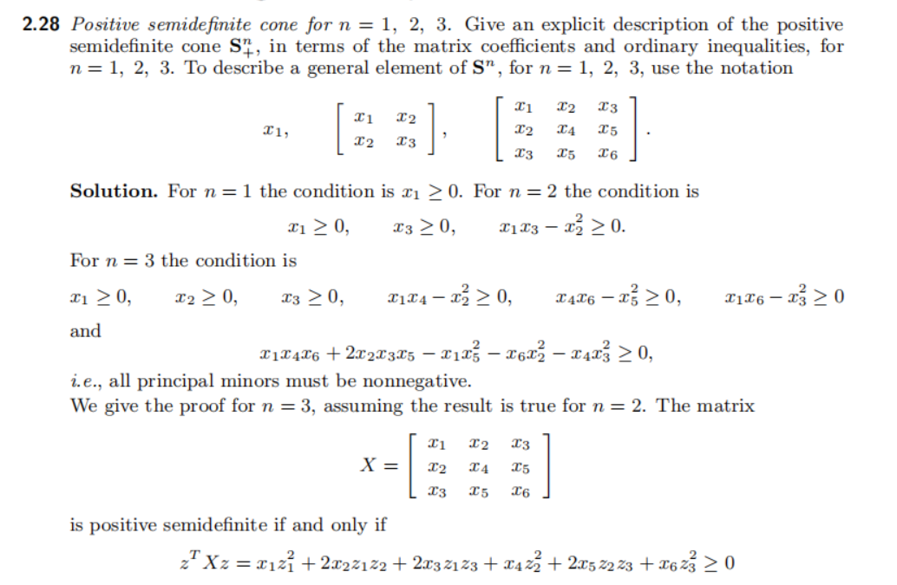
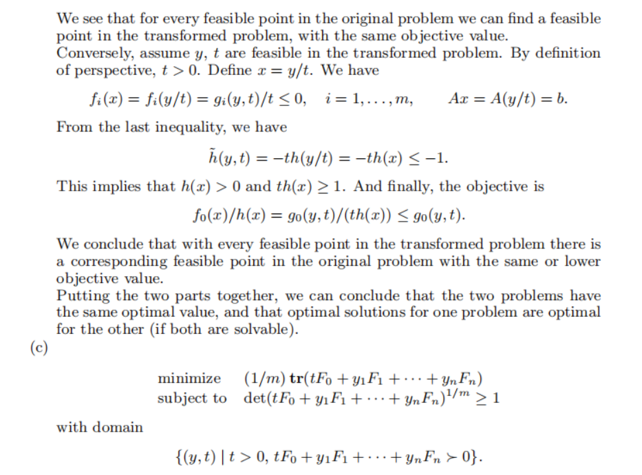

# 课后题

# Convex Sets

## Definition of convexity

### 2.1

### 2.10

### 2.11

## Operations that preserve convexity

### 2.16

### 2.17

### 2.18

### 2.21

### 2.23

## Convex cones and generalized inequalities

### 2.28

# Convex functions

## Definition of convexity

### 3.8

### 3.16

### 3.17

### 3.18

### 3.26

## Operations that preserve convexity

### 3.32

# Convex optimization problems

## Basic terminology and optimality conditions

### 4.3

### 4.7

## Linear optimization problems

### 4.9

### 4.20

## Quadratic optimization problems

### 4.22

## Semidefinite programming and conic form problems

### 4.40

## Vector and multicriterion optimization

### 4.51

## Miscellaneous problems

### 4.59

### 4.62

# Duality

## Examples and applications

### 5.5

### 5.20

## Optimality conditions

### 5.27

