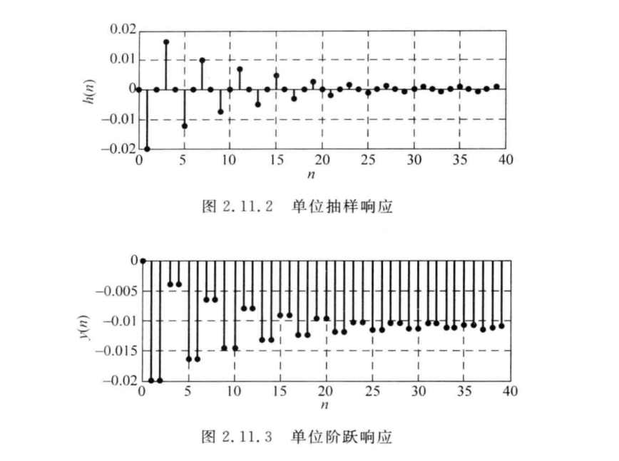

# 期末复习

数字信号处理

课本题目 

P51,1.6,1.7
P91,2.5,2.6,2.8,2.11
P163,3.4,3.6,3.7,3.8,3.11
P215,例5.7.1
P223,5.5,5.7,5.8,5.11
P504,12.1,12.2,12.3,124,12.5,12.6,12.7,12.8
P511,自相关函数的快速计算步骤
P515,周期图法,BT法功率谱估计的框图及步骤
P537,13.1,13.2,13.4,13.5
P545-546,Levinson-Durbin快速算法求解Yule-Walker方程的步骤
P591,14.9,14.10
P596-603,例15.3.1,例15.4.1,例15.5.1
P605,15.1,15.2,15.3,15.4,15.5

## P51

### 1.6

### 1.7

## P91

### 2.5

### 2.6

### 2.8

### 2.11

## P163

### 3.4

### 3.6

### 3.7

### 3.8

### 3.11

## P215

例5.7.1

## P223

### 5.5

P223,5.5,5.7,5.8,5.11

## P504

P504,12.1,12.2,12.3,124,12.5,12.6,12.7,12.8
P511,自相关函数的快速计算步骤
P515,周期图法,BT法功率谱估计的框图及步骤
P537,13.1,13.2,13.4,13.5
P545-546,Levinson-Durbin快速算法求解Yule-Walker方程的步骤
P591,14.9,14.10
P596-603,例15.3.1,例15.4.1,例15.5.1
P605,15.1,15.2,15.3,15.4,15.5

