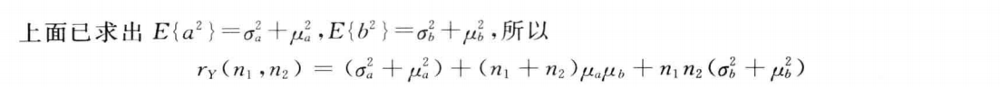
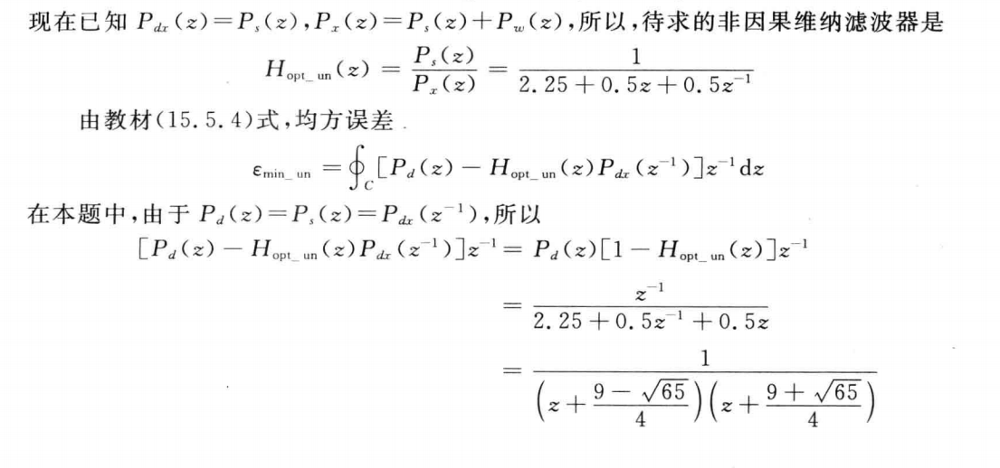
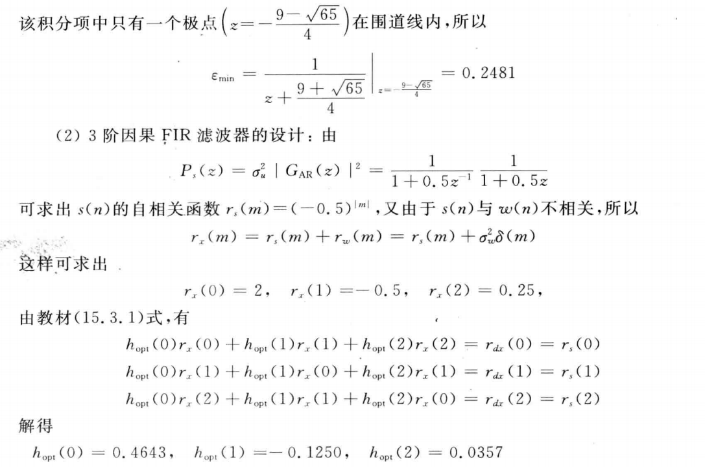

# 期末复习

# 经典数字信号处理

## P51

### 1.6

### 1.7

## P91

### 2.5

### 2.6

### 2.8

### 2.11

## P163

### 3.4

### 3.6

### 3.7

### 3.8

### 3.11

## P215

### Lattice结构important

注意老师要求不一样

## P223

### 5.5

### 5.7

### 5.8

### 5.11

# 统计数字信号处理

## P504

### 12.1

### 12.2

### 12.3

### 12.4

### 12.5

### 12.6

### 12.7

### 12.8

## P511

自相关函数的快速计算步骤

## P515

周期图法,BT法功率谱估计的框图及步骤

## P537

### 13.1

### 13.2

### 13.4

### 13.5

## P545

Levinson-Durbin快速算法求解Yule-Walker方程的步骤

## P591

### 14.9

### 14.10

## P596

P596-603,例15.3.1,例15.4.1,例15.5.1

### 例15.3.1

### 例15.4.1

### 例15.5.1

## P605

### 15.1

### 15.2

### 15.3

### 15.4

### 15.5

